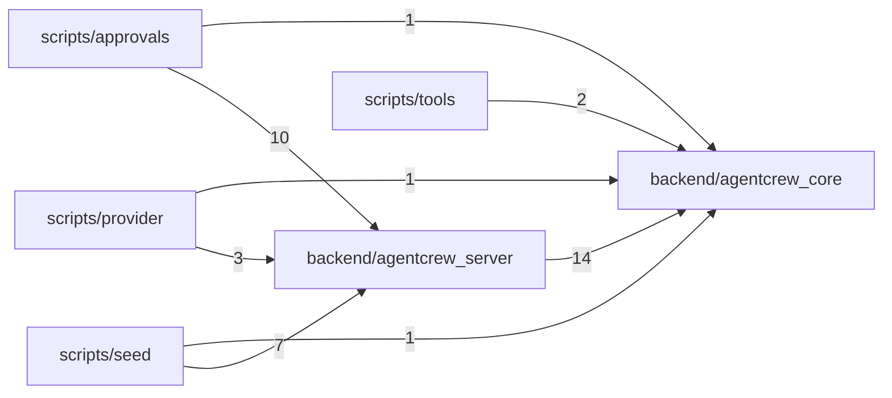

# Structure Map

Generated by `map_structure.py` on 2026-09-30 at commit `60f20a2`. Evidence for judgement, not a verdict: read each finding, then decide. Regenerate when the commit differs from `git rev-parse --short HEAD`.

- Files: 57 source, 22 test; 233 top-level symbols; python 50, typescript 7
- Packs: `references/languages/python.md`, `references/frameworks/fastapi.md`, `references/frameworks/react.md`
- Components: 9 at depth 2; 0 cycle(s)

## Findings

| Finding | Count |
| --- | --- |
| Misplaced | 0 |
| Mixed | 0 |
| Duplicates | 3 |
| Name clashes | 1 |
| Synonyms | 0 |
| Families | 0 |
| Junk drawers | 0 |
| Flat folders | 0 |
| Unreferenced | 0 |
| Comment-heavy | 0 |
| Names | 55 |
| Cycles | 0 |

### Duplicates

- same shape, 16 lines: `backend/agentcrew_server/db/queries.py:71` `iter_conversation_events`, `backend/agentcrew_server/db/queries.py:89` `iter_task_events`
- same shape, 8 lines: `backend/agentcrew_server/db/projections.py:167` `_step_completed`, `backend/agentcrew_server/db/projections.py:185` `_llm_done`
- same shape, 6 lines: `backend/agentcrew_server/db/queries.py:30` `max_global_seq_for_conversation`, `backend/agentcrew_server/db/queries.py:38` `max_seq_for_task`

### Name clashes

- `EventStore` (python): `backend/agentcrew_core/ports/__init__.py:14`, `backend/agentcrew_server/db/event_store.py:33`

### Names

- too-short (N5): 26 — `ih` (`backend/agentcrew_server/approvals.py:107`), `p` (`backend/agentcrew_server/approvals.py:280`), `ih` (`backend/agentcrew_server/approvals.py:300`), `ts` (`backend/agentcrew_server/db/audit.py:33`), `ts` (`backend/agentcrew_server/db/audit.py:59`), ...
- numbered (N1, N4): 20 — `target1` (`scripts/approvals/c6_demo.py:136`), `task1` (`scripts/approvals/c6_demo.py:137`), `seq0` (`scripts/approvals/c6_demo.py:140`), `call1` (`scripts/approvals/c6_demo.py:141`), `result1` (`scripts/approvals/c6_demo.py:160`), ...
- vague (N1): 8 — `obj` (`backend/agentcrew_core/provider/sse_parser.py:31`), `data` (`backend/agentcrew_server/api/sse.py:59`), `data` (`backend/agentcrew_server/api/sse.py:66`), `item` (`backend/agentcrew_server/api/sse.py:118`), `item` (`backend/agentcrew_server/api/sse.py:169`), ...
- noise-word (N1, G17): 1 — `DiagnosticInfo` (`backend/agentcrew_server/runtime.py:25`)
- ... and 39 more in structure.json

## Proposed moves

No moves proposed.

## Tree

| Folder | Role | Files | Symbols | Flagged |
| --- | --- | --- | --- | --- |
| `backend/agentcrew_core` | - | 1 | 0 | 0 |
| `backend/agentcrew_core/events` | - | 1 | 2 | 0 |
| `backend/agentcrew_core/loop` | - | 1 | 0 | 0 |
| `backend/agentcrew_core/ports` | - | 1 | 1 | 1 |
| `backend/agentcrew_core/provider` | - | 5 | 21 | 0 |
| `backend/agentcrew_core/recovery` | - | 1 | 0 | 0 |
| `backend/agentcrew_core/tools` | - | 6 | 38 | 0 |
| `backend/agentcrew_server` | - | 12 | 43 | 0 |
| `backend/agentcrew_server/api` | - | 7 | 29 | 0 |
| `backend/agentcrew_server/db` | - | 9 | 63 | 3 |
| `backend/agentcrew_server/run_manager` | - | 1 | 0 | 0 |
| `desktop` | - | 1 | 0 | 0 |
| `desktop/src/main` | - | 2 | 2 | 0 |
| `desktop/src/preload` | - | 1 | 0 | 0 |
| `desktop/src/renderer/src` | - | 3 | 4 | 0 |
| `scripts` | - | 1 | 0 | 0 |
| `scripts/approvals` | - | 1 | 6 | 0 |
| `scripts/provider` | - | 1 | 9 | 0 |
| `scripts/seed` | - | 1 | 14 | 0 |
| `scripts/tools` | - | 1 | 1 | 0 |

## Components

| Component | Files | Ca | Ce | I | A | D |
| --- | --- | --- | --- | --- | --- | --- |
| `backend/agentcrew_core` | 16 | 12 | 0 | 0.00 | 0.08 | 0.92 |
| `backend/agentcrew_server` | 29 | 3 | 6 | 0.67 | 0.00 | 0.33 |
| `desktop` | 1 | 0 | 0 | - | - | - |
| `desktop/src` | 6 | 0 | 0 | - | 0.67 | - |
| `scripts` | 1 | 0 | 0 | - | - | - |
| `scripts/approvals` | 1 | 0 | 11 | 1.00 | - | - |
| `scripts/provider` | 1 | 0 | 4 | 1.00 | - | - |
| `scripts/seed` | 1 | 0 | 8 | 1.00 | - | - |
| `scripts/tools` | 1 | 0 | 2 | 1.00 | - | - |

## Files

| File | Role | Symbols | Purpose |
| --- | --- | --- | --- |
| `backend/agentcrew_core/__init__.py` | - | - | agentcrew_core：纯库层（harness-session.md §9 分包纪律）。 本包不 import FastAPI / sqlite3；对模型、磁盘、时钟等外部系统的访问一律经... |
| `backend/agentcrew_core/events/__init__.py` | - | `RunEventType`, `Event` | 事件类型枚举与事件信封（契约：docs/contracts/events.md；定义：harness-session §3）。 纪律：新增机制先加事件类型再写实现；append-only，不改历... |
| `backend/agentcrew_core/loop/__init__.py` | - | - | ReAct 主循环与回合守门（harness-session.md §5）。M0-C8 填充。 |
| `backend/agentcrew_core/ports/__init__.py` | - | `EventStore` | core 到外部系统的 Port 接口定义（harness-session §9）。 core 只依赖这些协议；agentcrew_server 提供真实实现（SQLite/时钟等）。 随卡片逐... |
| `backend/agentcrew_core/provider/__init__.py` | - | - | Provider 层：协议、归一事件类型、GLM 适配器（harness-session §8 / ADR-009）。 |
| `backend/agentcrew_core/provider/base.py` | - | `Provider` | Provider 协议（harness-session §8）：core/循环 依赖此抽象，不依赖具体适配器。 messages/tools 为 Provider 原生格式（GLM/Anthro... |
| `backend/agentcrew_core/provider/glm_anthropic.py` | - | `_ProviderStreamError`, `SlotConfig`, `backoff_seconds`, `should_retry`, `classify_error`, `_short_message`, `_usage`, `_merge_usage`, +3 | GLM 适配器（Anthropic 兼容端点，ADR-009）。 - 请求：POST {base_url}/v1/messages（x-api-key + anthropic-version），... |
| `backend/agentcrew_core/provider/sse_parser.py` | - | `SSEDecodeError`, `iter_sse_json` | 上游 SSE 流的最小确定性行解析器（ADR-009）。 只服务 Provider 消费模型 API 的流式响应：按 SSE 规范聚合 data: 行 （多行以 \n 拼接）、忽略注释行（: 开... |
| `backend/agentcrew_core/provider/types.py` | - | `ErrorClass`, `Usage`, `ToolCall`, `ProviderError`, `StreamEvent`, `text_delta`, `thinking_delta` | Provider 层数据类型与协议（harness-session §8）。 归一事件：text_delta / thinking_delta / tool_call_started / too... |
| `backend/agentcrew_core/recovery/__init__.py` | - | - | 启动对账、事件重放器、resume 组装（harness-session.md §7）。M0-C9 填充。 |
| `backend/agentcrew_core/tools/__init__.py` | - | - | 工具层（harness-session §6 / ADR-008）：元数据、判定、注册表、调度器、五件套。 |
| `backend/agentcrew_core/tools/builtin.py` | - | `_check_path`, `_externalize`, `_read_file`, `_write_file_extras`, `_open_dir_nofollow`, `_write_file`, `_sbpl_quote`, `seatbelt_profile`, +7 | 五个内置工具（harness-session §6.1 五件套 / ADR-008 / v1.7 语义）。 - read_file：分页读（惰性按行取，拾取字节达硬上限即停扫），scope/受保... |
| `backend/agentcrew_core/tools/gate.py` | - | `PermissionRule`, `GateResult`, `rule_matches`, `evaluate_gate`, `approval_target`, `always_scope_pattern` | 权限闸门判定纯函数（governance §2.3 三级闸门 / harness-design §5）。 第 1 闸：元数据分级——只读（含 bash 动态只读判定）放行；risk=high 且... |
| `backend/agentcrew_core/tools/judgment.py` | - | `_first_word_identity`, `bash_readonly`, `_within`, `path_in_scope`, `path_is_protected`, `build_protected_paths`, `host_allowed` | 判定纯函数（harness-session §6.1 判定纪律 / ADR-008）。 全部无副作用、可参数化单测；路径判定一律先 realpath（解析符号链接）再比前缀。 |
| `backend/agentcrew_core/tools/metadata.py` | - | `ToolMetadata`, `ToolInvocation`, `ToolResult`, `Tool`, `WorkContext` | 工具层类型：ToolMetadata / 工具与调用 / 结果 / 执行上下文（harness-session §6）。 ToolMetadata 字段逐一对齐设计；副作用三分类按 ADR-00... |
| `backend/agentcrew_core/tools/scheduler.py` | - | `ToolRegistry`, `new_call_id`, `input_hash`, `redact_event_input`, `ToolScheduler` | 工具注册表与调度器（harness-session §6.2）。 调度规则（与设计一致）：concurrent_safe（或只读）可并行，其余串行； 并发上限 4。 外审回稿修复： - call... |
| `backend/agentcrew_server/__init__.py` | - | - | agentcrew_server：FastAPI 装配层（api / db / run_manager，harness-session.md §9）。 实现 agentcrew_core 的 P... |
| `backend/agentcrew_server/__main__.py` | - | - | python -m agentcrew_server 入口（用法见 cli.py 模块说明）。 |
| `backend/agentcrew_server/api/__init__.py` | - | - | HTTP API 装配层：路由、CORS、错误信封（backend-service.md / contracts/openapi.yaml）。 |
| `backend/agentcrew_server/api/app.py` | middleware | `DiagnosticGuardMiddleware`, `create_app` | FastAPI 装配：/api/health、/api/diagnostics、CORS allow-all、统一错误信封。 契约：docs/contracts/openapi.yaml v0.... |
| `backend/agentcrew_server/api/approvals.py` | schema | `ApprovalDecisionRequest`, `install_approval_routes` | 审批 API（M0-C6）：POST /api/tool-approvals/:callId + GET pending（契约 v0.3）。 |
| `backend/agentcrew_server/api/auth.py` | middleware | `BearerAuthMiddleware` | Bearer 鉴权中间件（M0-C3）：无/错 token → 401 UNAUTHORIZED。 - 豁免：仅 /api/health（契约 security: []；CORS 预检由最外层... |
| `backend/agentcrew_server/api/envelope.py` | middleware | `EnvelopeMiddleware`, `_header`, `_set_header`, `_maybe_wrap` | 成功响应信封中间件：JSON 成功响应统一包裹为 {"data": ...}（backend-service.md §6）。 规则（契约 docs/contracts/openapi.yaml... |
| `backend/agentcrew_server/api/errors.py` | - | `ErrorCode`, `ApiError`, `error_body`, `error_response`, `install_error_handlers` | 统一错误信封与错误码表（backend-service.md §6）。 错误 = {"error": {"code", "message", "detail?"}}；成功 = {"data":... |
| `backend/agentcrew_server/api/sse.py` | - | `_retry_hint`, `_data_frame`, `_resync_frame`, `_shutdown_frame`, `_subscribe_or_503`, `_conversation_stream`, `_task_stream`, `install_sse_routes`, +7 | SSE 端点（M0-C3）：会话级流与任务级流 + 任务事件 JSON 分页。 协议（backend-service §3 / contracts/events.md v1.1）： - 游标 f... |
| `backend/agentcrew_server/approvals.py` | service | `ApprovalNotFound`, `ApprovalStale`, `_Pending`, `_now`, `_detail`, `ApprovalService` | 审批闸门服务（M0-C6，governance §2.3 三级闸门 / harness-session §6.2）。 事件序列（§6.2）：TOOL_PREPARED（落库）→ [闸门：PERM... |
| `backend/agentcrew_server/bus.py` | - | `ConnectionLimitError`, `Topic`, `Subscription`, `EventBus` | 进程内事件总线（M0-C3）：订阅/扇出/背压/优雅关闭。 设计依据 backend-service §2/§3： - publish 由 EventStore 在**写通道线程**内、事务提交... |
| `backend/agentcrew_server/cli.py` | - | `parse_args`, `pick_port`, `_parent_watchdog`, `_overflow_sweeper`, `_GracefulServer`, `serve`, `main` | agentcrew_server 入口：启动序列（backend-service.md §1）与退出码约定。 顺序：读参数与环境（AGENTCREW_TOKEN）→ data-dir 准备（§9... |
| `backend/agentcrew_server/config.py` | - | `ConfigError`, `merge_config`, `_get_path`, `_set_path`, `_coerce`, `apply_env`, `_require_int`, `_require_str`, +3 | 配置链：环境变量 > data/config.json > 代码默认值（backend-service.md §4）。 合并与覆盖逻辑（merge_config / apply_env）是纯函数... |
| `backend/agentcrew_server/db/__init__.py` | - | - | SQLite 落盘层：连接管理 / 写通道 / 版本化迁移 / EventStore / 投影 / 审计链（M0-C2）。 |
| `backend/agentcrew_server/db/audit.py` | - | `compute_hash`, `ChainVerification`, `verify_internal`, `CorruptChainHeadError`, `read_chain_head`, `verify_with_anchor`, `snapshot_chain_head`, `append_audit` | 审计哈希链：校验与链头快照（governance §3）。 - hash = sha256("v2\|" + JSON 数组 [seq, ts, actor_type, actor_id, act... |
| `backend/agentcrew_server/db/database.py` | - | `Database` | SQLite 连接管理：写连接（WAL）+ 每线程只读连接（backend-service §2）。 - 写连接只经 WriteChannel 使用（单写 executor + busy 重试）... |
| `backend/agentcrew_server/db/event_store.py` | - | `_utc_now`, `EventStore` | EventStore：run_events 追加 + 投影同步，单事务（ADR-001 / backend-service §2）。 - 任务内 seq = 该任务已有最大 seq + 1（写通... |
| `backend/agentcrew_server/db/migrations.py` | - | `Migration`, `MigrationConflictError`, `MigrationFailedError`, `MigrationResult`, `_now`, `_is_busy`, `_bootstrap_version_table`, `_current_version`, +3 | 版本化迁移（backend-service.md §1）。 - schema_migrations 自举（CREATE IF NOT EXISTS，幂等） - 目标版本 > 当前版本：先 VAC... |
| `backend/agentcrew_server/db/projections.py` | - | `_noop`, `_run_queued`, `_attempt_started`, `_run_started`, `_run_resumed`, `_run_finished`, `_run_completed`, `_run_failed`, +22 | 投影表处理器：事件 → 投影行（harness-session §2.2/§2.3）。 纪律： - 投影是事件的纯函数——行 id 一律取自事件载荷（或由事件 id 派生）， 保证重放（rebu... |
| `backend/agentcrew_server/db/queries.py` | - | `_row_to_event`, `max_global_seq_for_conversation`, `max_seq_for_task`, `conversation_batch`, `task_batch`, `iter_conversation_events`, `iter_task_events`, `conversation_exists`, +1 | 事件读取查询（只读连接；SSE 历史补播与 JSON 分页共用）。 游标一律**排他**（返回 seq/global_seq > 游标的事件）；分批拉取避免长会话 一次性载入；`up_to_*`... |
| `backend/agentcrew_server/db/schema_v1.py` | - | - | M0 初始建表 DDL（版本 1）。 表结构唯一权威：harness-session §2（执行域 12 表）+ governance §2.3/§3 （agent_permission_rul... |
| `backend/agentcrew_server/db/write_channel.py` | - | `_is_busy`, `WriteChannel` | 写通道：全部数据库变更的唯一通道（backend-service.md §2）。 - 单写 executor（单线程线程池）——写入天然全局串行，发布顺序 = 提交顺序； - 事务内不等待任何外... |
| `backend/agentcrew_server/instance_lock.py` | - | `DataDirNotWritable`, `InstanceLockError`, `prepare_data_dir`, `InstanceLock` | data-dir 准备与 instance.lock 单实例锁（backend-service.md §1/§9）。 退出码约定（M0-cards C1）：data-dir 不可写 = 1（明确... |
| `backend/agentcrew_server/lifecycle.py` | - | `run_startup_hooks` | 启动序列中仍属后置卡片的步骤挂钩（backend-service.md §1）。 C2 起迁移/升级前快照/审计链校验已是真实实现（migrations.py / audit.py， 由 cli... |
| `backend/agentcrew_server/logging_setup.py` | - | `RedactingFormatter`, `setup_logging`, `shutdown_logging` | 日志装配：data/logs/sidecar.log 轮转 5MB×3 + stderr 双输出，机密值脱敏。 token / api_key 永不落日志（红线）：登记进 secrets 后由... |
| `backend/agentcrew_server/providers.py` | - | `build_provider` | 服务层 Provider 装配：config.models 双槽 → GLM 适配器（M0-C4，ADR-009）。 |
| `backend/agentcrew_server/run_manager/__init__.py` | - | - | RunManager：每 TaskRun 一个 asyncio 任务、注册表与取消传播。M0-C8 填充。 |
| `backend/agentcrew_server/runtime.py` | - | `DiagnosticInfo`, `RuntimeState` | 服务运行时上下文：装配层共享句柄与优雅关闭步骤（backend-service.md §7）。 |
| `backend/agentcrew_server/secrets.py` | - | `register_secret`, `known_secrets`, `redact`, `reset` | 机密值登记与日志脱敏（安全红线：AGENTCREW_TOKEN 与 api_key 绝不进日志）。 外审回稿修订：取消登记的最小长度限制——红线是绝对的，登记表里只有被 显式注册为机密的值（to... |
| `desktop/electron.vite.config.ts` | - | - | - |
| `desktop/src/main/index.ts` | - | - | - |
| `desktop/src/main/sidecar.ts` | - | `signalTree`, `Sidecar` | - |
| `desktop/src/preload/index.ts` | - | - | - |
| `desktop/src/renderer/src/App.tsx` | component | `NarrowPanel`, `App` | - |
| `desktop/src/renderer/src/desktop-api.d.ts` | - | `AgentCrewDesktopApi`, `Window` | - |
| `desktop/src/renderer/src/main.tsx` | - | - | - |
| `scripts/approvals/c6_demo.py` | - | `setup`, `fire_tool`, `wait_for_request`, `latest_event_seq`, `main_async`, `main` | M0-C6 验收演示（进程内直调 + 真实 HTTP）。 步骤： 1. |
| `scripts/check_openapi.py` | - | - | CI 守卫：contracts/openapi.yaml 必须是合法 YAML，且响应信封与 backend-service §4 一致。 |
| `scripts/provider/verify.py` | - | `drain`, `assert_clean_run`, `counts`, `cmd_plain`, `cmd_tooluse`, `cmd_badkey`, `cmd_cache`, `main_async`, +1 | M0-C4 Provider 验证脚本（真实 GLM key，ADR-006 禁 mock）。 四个子命令（对应 M0-cards C4 验收）： plain ① 无工具纯文本流式（text_d... |
| `scripts/seed/c3_acceptance.py` | - | `setup_runtime`, `produce`, `parse_frames`, `sse_collect`, `check`, `paced_sse_reader`, `scenario_replay_to_live`, `scenario_exclusive_resume`, +6 | M0-C3 验收驱动：同进程起真实 uvicorn + 真实 EventStore 生产者。 事件生产者与 HTTP 服务同进程（符合"单进程写者"设计——事件总线扇出的帧 来自本进程写通道提交... |
| `scripts/tools/c5_demo.py` | - | `main` | M0-C5 验收演示脚本（可复核：输出与 docs/acceptance/M0-C5.md 引用一致）。 真实执行六项：Seatbelt 越界写拒绝 / 沙盒断网（本地端口对照） / token... |
