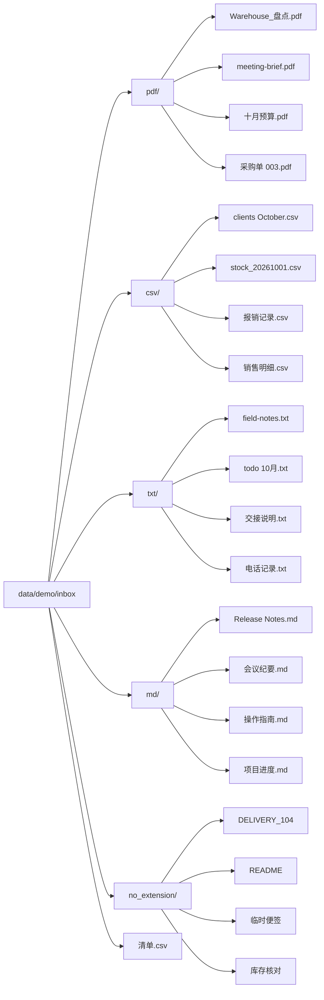

# M0 验收报告 · C12

验收日期：2026-10-01，Asia/Shanghai。工作树为 `/Users/yyhdbl/Desktop/workMate/agentcrew-desktop`，分支为 `desktop-shell`。本轮九项真实验收通过六项、失败三项，等待项目所有者人工核验。恢复后审批卡缺失阻断整理任务完成，M0 收口条件尚未满足。

## 考试环境与第零步

`desktop-shell@71406b1` 合并 `main@39684fe`，合流提交为 `992bed1`。合并保留 `test_tools_builtin.py` 的本地 HTTP fixture 和 `test_sse_api.py` 的本地监听对照；测试临时文件使用 pytest 的 `tmp_path`。这两个文件独立提交至 main，提交为 `6986704`，已经推送。后端运行代码保持合流内容。

两个工作树均执行 `uv sync`，随后分别执行 `uv run pytest -q`，使用仓库忽略目录中的 `--basetemp`。desktop-shell 为 **402 passed、1 warning，118.57 秒**；main 为 **402 passed、1 warning，118.44 秒**。两分支收集的 402 个测试标识完全一致，这两个文件内容相同，见 [test-alignment.json](./assets/C12/test-alignment.json)、[desktop 测试输出](./assets/C12/backend-desktop-tests.txt)、[main 测试输出](./assets/C12/backend-main-tests.txt)。原 main 的 403 项包含额外的外部网络封锁用例；本轮采用分支已有的本地监听正反对照，统一为 402 项。最初并行运行两个工作树时，进程清理测试通过全局进程检索互相影响；分别运行后全部通过。原始诊断日志保留在忽略目录 `data/c12-intermediate/backend-desktop-concurrent.txt` 和 `backend-main-concurrent.txt`。

`desktop/` 中的 `npm run typecheck` 与 `npm run build` 均通过，见 [desktop-build.txt](./assets/C12/desktop-build.txt)。种子脚本完成生成、内容核验、重置及再次核验，见 [seed-check.txt](./assets/C12/seed-check.txt)。复核在忽略目录内运行同一脚本的副本，保留了实际考试结果。

`backend/data/config.json` 中 GLM key 存在，文件被 Git 忽略且未被追踪。验收实例使用相同配置的忽略副本，实际模型为 `glm-5.3-flash`，Provider 地址为 `https://open.bigmodel.cn/api/anthropic`。本轮运行真实 Electron、真实 Python sidecar、真实 GLM 和真实文件，审批决定均通过界面点击提交。恢复接口是卡片明确允许的界面缺口处理；其余操作通过界面完成。

## 九项验收

| 项目 | 判定 | 实际结果与证据 |
|---|---|---|
| 1. 任务完成与清单 | **失败** | 20 个文件正确归入五种目录，清单包含全部 20 条，原名、内容、大小、mtime 均一致；执行整理的运行最终 cancelled，缺少完成终态。见 [文件核验](./assets/C12/files-verification.json)、[取消状态截图](./assets/C12/13-organize-cancelled.png)，目录树与清单全文附后。归属 C11 / FE08，恢复后审批显示需要返工。 |
| 2. 写操作审批及总是允许 | **通过** | 初次 write_file 真实点击“总是允许”，global_seq=17 为 allow_always；规则限定工作空间目录。后续清单 write_file 在 60–64 直接完成，同类授权范围内未再申请审批。移动及复制的 bash 分别真实批准。见 [移动审批](./assets/C12/09-move-approval.png)、[复制审批](./assets/C12/10-manifest-copy-approval.png)、[SQL 输出](./assets/C12/sql-results.csv)。 |
| 3. SIGKILL、重启、恢复及无重复副作用 | **失败** | 两次真实 SIGKILL 均触发 Electron 自动重启和前端重连，任务进入 interrupted；两次 resume 返回 202。第二次恢复后后端等待审批为 1，前端没有审批按钮，使用真实停止按钮终止到 cancelled。write_file 每个目标 prepared 恰好一次，内容与 mtime 未变。见 [中断截图](./assets/C12/11-organize-interrupted.png)、[缺失审批截图](./assets/C12/12-resumed-approval-missing.png)、[恢复响应](./assets/C12/organize-resume-response.json)、[副作用核验](./assets/C12/no-repeat-effects.json)。归属 C11 / FE08；恢复按钮缺失单独列入已知缺口。 |
| 4. 单任务事件及投影 | **失败** | 全部任务的 seq 连续，llm_calls/tool_calls 投影与请求、prepared 事件计数一致。实际整理运行只有 queued→started→interrupted→resumed→cancelled，没有要求的 completed。按本项完整条件判定失败；数据库计数核验通过。见 [查询](./assets/C12/verification.sql)、[全部 SQL 结果](./assets/C12/sql-results.csv)，关键查询与结果附后。归属同一 C11 阻断，尚无证据表明事件存储损坏。 |
| 5. 进行中刷新与事件重放 | **通过** | 初次 write_file 等待审批期间通过 Electron 刷新页面，用户指令、步骤、工具卡及 running / 等待审批 1 恢复，随后真实批准。见 [03-refresh-restored.png](./assets/C12/03-refresh-restored.png)，事件 15–21 对应刷新前待审批到批准完成。 |
| 6. 审计链两级校验 | **通过** | 正常退出 Electron 后，使用现有 verify_internal 和 verify_with_anchor 全量重算，均为 ok=true、checked_count=23；chain-head.txt 的 seq/hash 与数据库最终记录一致。见 [audit-verification.json](./assets/C12/audit-verification.json)、[真实锚点副本](./assets/C12/audit-chain-head.txt)。 |
| 7. 材料导入、原件及 scope | **通过** | 原生窗口选择 PDF、TXT、CSV 三份真实材料，复制内容一致，原件 SHA-256、大小和 mtime 均未改变；scope 与界面展示一致。第四份真实文件选择后移动到保留目录，发送时原路径不存在，界面逐项显示“文件不存在”。见 [原生选择](./assets/C12/14-native-materials.png)、[材料与范围](./assets/C12/15-materials-and-scope.png)、[核验](./assets/C12/materials-verification.json)、[完成态](./assets/C12/16-materials-completed.png)。 |
| 8. 排队完整链 | **通过** | 运行中加入两条指令，停止后“队列已暂停 · 2 条”且不会自动执行；继续后队首实际执行，取消剩余一条，再回答实际问题使队首读取真实文件并完成。最终队列为空、运行数 2、用户消息数 3。见 [排队](./assets/C12/17-queue-two.png)、[暂停](./assets/C12/18-queue-paused.png)、[取消剩余](./assets/C12/20-queue-rest-cancelled.png)、[完成态](./assets/C12/21-queue-completed.png)、[最终状态](./assets/C12/queue-final.json)。 |
| 9. 截屏存档与发布检查 | **通过** | 21 张真实截图覆盖任务指令、审批、刷新、中断、恢复缺口、材料、排队和实际完成态；逐张查看未发现 key/token。见 [截图检查记录](./assets/C12/screenshots-review.md)、[发布检查](./assets/C12/publication-check.json)。整理任务没有完成态，保存其真实取消态；材料和队首任务完成态已保存。 |

## 整理任务运行经过与失败归属

整理会话为 `3e4e0da5582f49bcaca9c9469f757c99`。通过界面授权 inbox 文件夹并派发“把 inbox 里的文件按类型整理到子文件夹并生成清单.csv”，同时要求先生成整理说明、保留原名与内容及修改时间。

第一次运行 `073d3fa69be7413a9da3546933d03845` 已写入 `整理说明.md`，实际产生 ask_user 后，对 Python PID **34563** 发送 SIGKILL。端口由 **61147** 变为 **63088**，global_seq=29 为 `run.interrupted`。界面没有恢复按钮，使用 `POST /api/task-runs/073d3fa69be7413a9da3546933d03845/resume`，202 响应及 warnings=[] 见 [resume-response.json](./assets/C12/resume-response.json)。模型恢复后仅回复等待确认，运行在 35 completed；文件移动尚未发生，未据此宣称整理完成。按照实际状态通过界面发送明确继续指令，创建第二次运行。

第二次运行 `f0999d4886bf446c95300610675af494` 完成分类、write_file 生成清单及复制。清单复制工具 `call_1f799107221741f79d713154` 完成后，任务仍在运行，最后水位为 75；对 Python PID **35267** 再次发送 SIGKILL。端口由 **63088** 变为 **49902**，76 为 interrupted，77 为 resumed。见 [第一次进程与文件基线](./assets/C12/kill-before.json)、[第一次自动重连](./assets/C12/reconnected-interrupted.json)、[第二次中断前基线](./assets/C12/organize-kill-before.json)、[第二次自动重连](./assets/C12/organize-interrupted.json)。

恢复后模型实际请求 bash 核验，82 为 tool.prepared，83 为 permission.requested。后端 state 显示 running、waiting_approvals=1，界面却没有审批卡。[Conversation.tsx](../../desktop/src/renderer/src/Conversation.tsx) 第 45 行将历史 run.interrupted 加入以 task_run_id 为键的 terminal 集合，第 60 行据此过滤审批卡；同一任务的新 attempt 被旧终态持续影响，第 67 行也将恢复中的步骤显示为“已结束”。这是 **C11 / FE08** 的恢复显示问题。返工应按当前 attempt 与最新运行生命周期计算审批、提问和步骤状态，并使用真实中断→恢复→新审批操作验证。此轮没有修改该代码，也没有通过接口批准缺失的审批卡；点击界面“停止任务”，84 记录 run.cancelled。

模型没有再次提问、材料回复没有列出失败文件等自主文字行为均按实际记录。材料界面和数据库确实保留了逐文件错误，材料项判定依据为导入结果与真实文件。验收遵循 [ADR-006](../decisions/ADR-006-no-mock-testing.md)，模型叙述不替代文件、事件和数据库事实。

## 文件结果与人工核对

考试结果目录：`/Users/yyhdbl/Desktop/workMate/agentcrew-desktop/data/demo/inbox/`。20 个原文件合计 **89,356 字节**；五种分类各四个文件，根目录额外包含 1,010 字节的 `清单.csv`。逐文件 SHA-256、大小及纳秒修改时间均与种子基线一致，明细见 [files-verification.json](./assets/C12/files-verification.json)、[生成时基线副本](./assets/C12/source-manifest.json)、[清单原文件副本](./assets/C12/清单.csv)。该目录与运行数据库均处于 Git 忽略范围，保留在本机供所有者核验。



`清单.csv` 全文如下，实际文件使用 UTF-8，共 21 行：

```csv
原名,类型,相对路径,大小字节
Warehouse_盘点.pdf,pdf,pdf/Warehouse_盘点.pdf,4353
meeting-brief.pdf,pdf,pdf/meeting-brief.pdf,3400
十月预算.pdf,pdf,pdf/十月预算.pdf,1691
采购单 003.pdf,pdf,pdf/采购单 003.pdf,2513
clients October.csv,csv,csv/clients October.csv,2036
stock_20261001.csv,csv,csv/stock_20261001.csv,3054
报销记录.csv,csv,csv/报销记录.csv,4084
销售明细.csv,csv,csv/销售明细.csv,1026
field-notes.txt,txt,txt/field-notes.txt,11978
todo 10月.txt,txt,txt/todo 10月.txt,2970
交接说明.txt,txt,txt/交接说明.txt,6713
电话记录.txt,txt,txt/电话记录.txt,745
Release Notes.md,md,md/Release Notes.md,6713
会议纪要.md,md,md/会议纪要.md,2971
操作指南.md,md,md/操作指南.md,11978
项目进度.md,md,md/项目进度.md,744
DELIVERY_104,no_extension,no_extension/DELIVERY_104,6709
README,no_extension,no_extension/README,735
临时便签,no_extension,no_extension/临时便签,2968
库存核对,no_extension,no_extension/库存核对,11975
```

工作空间为 `data/c12-electron/data/workspaces/default/`。两次中断与恢复前后的副作用核对结果如下；完整摘要见 [no-repeat-effects.json](./assets/C12/no-repeat-effects.json)。

| 文件 | 字节数 | 中断前后 mtime_ns | 写入 prepared 次数 |
|---|---:|---:|---:|
| 工作空间/整理说明.md | 64 | 1790821319940310161，保持一致 | 1 |
| 工作空间/清单.csv | 1010 | 1790821651560190025，保持一致 | 1 |
| inbox/清单.csv | 1010 | 1790821715678017638，保持一致 | bash 复制一次 |

工作空间与 inbox 两份清单的 SHA-256 均为 `6201710deb5d24f06c62d8769255f6d507b7f98551de27ded5ba3491440e0d39`；整理说明为 `ed7119b17bff277414b8522446b0da13a66d13a9b01be13dd1ee57ff85088fc2`。

## SQL 直查与结果

数据库：`/Users/yyhdbl/Desktop/workMate/agentcrew-desktop/data/c12-electron/data/agentcrew.db`。实际执行：

```sh
sqlite3 -header -csv data/c12-electron/data/agentcrew.db '.read docs/acceptance/assets/C12/verification.sql'
```

完整查询与 147 条全局事件中的所有任务序号保存在 [verification.sql](./assets/C12/verification.sql) 和 [sql-results.csv](./assets/C12/sql-results.csv)。投影核对使用以下 SQL，统计基准分别为 llm.request_started 与 tool.prepared：

```sql
SELECT r.id AS task_run_id,r.status,r.current_attempt_no,
 (SELECT COUNT(*) FROM run_events e WHERE e.task_run_id=r.id) AS event_count,
 (SELECT MIN(seq) FROM run_events e WHERE e.task_run_id=r.id) AS min_seq,
 (SELECT MAX(seq) FROM run_events e WHERE e.task_run_id=r.id) AS max_seq,
 (SELECT COUNT(*) FROM llm_calls l JOIN steps s ON s.id=l.step_id WHERE s.task_run_id=r.id) AS llm_projection,
 (SELECT COUNT(*) FROM run_events e WHERE e.task_run_id=r.id AND e.type='llm.request_started') AS llm_events,
 (SELECT COUNT(*) FROM tool_calls t WHERE t.task_run_id=r.id) AS tool_projection,
 (SELECT COUNT(*) FROM run_events e WHERE e.task_run_id=r.id AND e.type='tool.prepared') AS tool_events,
 (SELECT COUNT(*) FROM run_events e WHERE e.task_run_id=r.id AND e.type='run.completed') AS completed_events
FROM task_runs r ORDER BY r.created_at;
```

```csv
task_run_id,status,current_attempt_no,event_count,min_seq,max_seq,llm_projection,llm_events,tool_projection,tool_events,completed_events
073d3fa69be7413a9da3546933d03845,completed,2,35,1,35,4,4,3,3,1
f0999d4886bf446c95300610675af494,cancelled,2,49,1,49,6,6,5,5,0
0e6eb81407ab46a285643f6c0e53a714,completed,1,25,1,25,3,3,3,3,1
ca1d0fddd60e4bc6a5626793726e05d5,cancelled,1,10,1,10,1,1,1,1,0
37c884c94b8b44138fa56424ee3ff01b,completed,1,23,1,23,3,3,2,2,1
```

整理运行关键生命周期的查询及结果：

```sql
SELECT seq,global_seq,attempt_no,type FROM run_events
WHERE task_run_id='f0999d4886bf446c95300610675af494'
 AND (type LIKE 'run.%' OR global_seq IN (82,83)) ORDER BY seq;
```

```csv
seq,global_seq,attempt_no,type
1,36,,run.queued
2,37,1,run.started
41,76,,run.interrupted
42,77,2,run.resumed
47,82,,tool.prepared
48,83,,permission.requested
49,84,2,run.cancelled
```

写入次数与持续授权的查询及结果：

```sql
SELECT task_run_id,json_extract(payload,'$.input.path') AS path,COUNT(*) AS prepared_count
FROM run_events WHERE type='tool.prepared' AND json_extract(payload,'$.tool_name')='write_file'
GROUP BY task_run_id,json_extract(payload,'$.input.path');
SELECT tool_name,pattern,effect FROM agent_permission_rules;
```

```csv
task_run_id,path,prepared_count
073d3fa69be7413a9da3546933d03845,整理说明.md,1
f0999d4886bf446c95300610675af494,/Users/yyhdbl/Desktop/workMate/agentcrew-desktop/data/c12-electron/data/workspaces/default/清单.csv,1
tool_name,pattern,effect
write_file,/Users/yyhdbl/Desktop/workMate/agentcrew-desktop/data/c12-electron/data/workspaces/default,allow
```

初次审批事件摘录：16 的 tool_call_id 为 `call_8447e066873244afb20e0a59`，target 为工作空间 `整理说明.md`；17 的载荷为 `{"decision":"allow_always","tool_call_id":"call_8447e066873244afb20e0a59"}`。后续清单写入为 60 prepared、61 dispatched、62 artifact.created、63 artifact.ready、64 completed，没有对应 permission.requested。完整参数见 [key-events.json](./assets/C12/key-events.json) 和 SQL 输出。

排队会话 `29da1528ed1a40f997cc754912c9a4d3` 核对查询及结果：

```sql
SELECT role,COUNT(*) AS message_count FROM messages
WHERE conversation_id='29da1528ed1a40f997cc754912c9a4d3' GROUP BY role;
SELECT id,status FROM task_runs
WHERE conversation_id='29da1528ed1a40f997cc754912c9a4d3' ORDER BY created_at;
SELECT type,COUNT(*) AS event_count FROM run_events
WHERE conversation_id='29da1528ed1a40f997cc754912c9a4d3' AND type LIKE 'queue.%'
GROUP BY type ORDER BY type;
```

```csv
role,message_count
assistant,1
user,3
id,status
ca1d0fddd60e4bc6a5626793726e05d5,cancelled
37c884c94b8b44138fa56424ee3ff01b,completed
type,event_count
queue.item_cancelled,1
queue.item_enqueued,2
queue.paused,1
queue.resumed,1
```

global_seq=119、120 分别入队；122 暂停；123 继续；124 的 run.queued 引用队首 item_id `e335e084a2674d0ba67717e4df29e00c`；133 取消剩余 item_id `a1836e4eeafc46ebb6eaae30d5d079a4`；147 为队首 run.completed。停止时间为 10:38:57，10:39:16 与 10:39:27 两次状态核对均为 idle、queue_paused=true、两条等待指令和一条运行记录，见 [首次暂停快照](./assets/C12/queue-paused.json) 与 [保持暂停快照](./assets/C12/queue-still-paused.json)。

## 审计、材料与数据保留

正常退出 Electron 后打开只读 SQLite 连接，调用 `verify_internal(conn)`、`verify_with_anchor(conn, Path('chain-head.txt'))` 和 `read_chain_head(...)`。实际内部结果及锚点结果均为 `{"ok":true,"broken_at_seq":null,"reason":null,"checked_count":23}`；真实锚点为 `23 41f015d9371b5fe7829c8ca06eecc0eab7dafd5e192922f37e03e9365f0fa1f7`，与数据库最后一条审计记录完全一致。验收没有自行写入锚点。

材料会话为 `f89401b88db4449899a0c124ab1ae146`，任务 `0e6eb81407ab46a285643f6c0e53a714` 完成。原件位于 `data/demo/material-input/`，文件为 `十月预算.pdf`、`电话记录.txt`、`销售明细.csv`。成功材料目录为 `data/c12-electron/data/conversations/f89401b88db4449899a0c124ab1ae146/materials/`；scope 的 workspace_dir 为本轮工作空间，materials_dir 为该材料目录，folders=[]，界面展开结果一致。缺失路径为 `data/demo/missing-selection/待导入便签.txt`；实际文件内容保留在 `data/demo/retained-source/待导入便签.txt`。选择后移走文件用于制造真实路径失效，导入返回具体原因，成功材料保持可用。

本机考试数据根目录为 `data/demo/`，Electron 数据目录为 `data/c12-electron/`，中间诊断目录为 `data/c12-intermediate/`，全部被忽略。原始种子基线为 `data/demo/source-manifest.json`，完整运行库和日志保留供人工核验。截图与报告发布前的逐张检查、文件摘要和文本凭证扫描见 [screenshots-review.md](./assets/C12/screenshots-review.md) 与 [publication-check.json](./assets/C12/publication-check.json)。配置与运行 token 没有提交。

种子脚本 [make_mess.py](../../scripts/seed/make_mess.py) 从仓库根定位数据目录，使用 ReportLab 生成真实多页 PDF，csv 模块生成真实 CSV，文本材料包含中文且大小不同。重跑前在 `backend/` 执行以下命令；`--reset` 会清除考试 inbox 并重新生成，所有者核验现有结果期间应保留现有目录。

```sh
uv run --with reportlab --with pypdf python ../scripts/seed/make_mess.py --reset
uv run --with reportlab --with pypdf python ../scripts/seed/make_mess.py --check
```

## 已知缺口与返工建议

| 缺口 | 归属 | 本轮证据与建议 |
|---|---|---|
| 恢复按钮缺失 | C11 / FE08，对接 C9 | 两次通过已交付 resume 接口驱动恢复，响应为 202；需提供 interrupted 任务的真实恢复入口及新 attempt 展示。 |
| 恢复后新审批卡缺失，步骤状态错误 | C11 / FE08 | 历史 interrupted 持续标记任务为 terminal，隐藏新审批；按当前 attempt 和最新生命周期重新计算状态，再真实验证中断恢复后审批及完成。该问题使第 1、3、4 项失败。 |
| messages 端点未实现 | C7 会话接口 / C11 历史契约 | `GET /api/conversations/29da1528ed1a40f997cc754912c9a4d3/messages` 实际返回 404、NOT_FOUND，见 queue-final.json。前端当前使用 SSE 事件历史恢复，后端需补齐声明的消息查询契约。 |

本轮未开发上述功能，未修改后端运行代码。M0 大考结果为 **6/9**。提交保存真实失败与通过证据后停止工作，等待项目所有者人工核验和 M0 收口确认；完成 C11 / FE08 返工并重新验证受阻链路后，才能确认完整验收通过。
