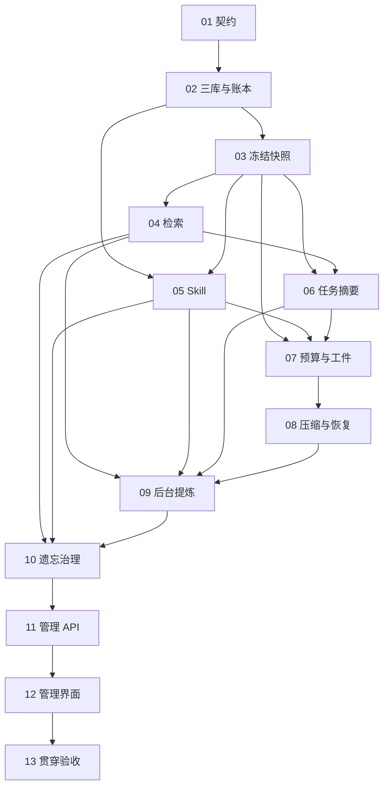

# M1 · Memory 实施任务卡

> 日期：2026-10-01 ｜ 状态：M1-01 至 M1-05 验收通过 ｜ 开工代码：desktop-shell `66f3df4`
> 设计依据：[Memory 系统详设](../architecture/memory-system.md)、[Harness 与 Session](../architecture/harness-session.md)、[权限治理](../architecture/governance.md)、[设计决策记录](../decisions/alignment-record.md)。

## 领取与交付约定

本文件规定 M1 的实施顺序、文件范围和验收要求。M0 C12 当前计分为 9/9，已获得 [所有者收口确认](../acceptance/M0-owner-confirmation.md)，M1 开工依赖已满足。卡片编写完成不代表相应功能已经实现。实施以当时最新代码为依据，领取时重新读取涉及文件。

按照 M1-01 至 M1-13 顺序领取，每张卡通过验收、提交并推送后再领取下一张。每张卡交付实现、必要回归和 `docs/acceptance/M1-XX.md`；公开证据进入 `docs/acceptance/assets/M1/XX/`。运行数据、数据库、凭据和中间结果放入已忽略的工作目录，验收报告只引用脱敏结果。失败须写明归属卡片、实际错误及返工建议。

复用现有 SQLite 迁移、串行写入通道、审计链、事件总线、Provider、工具调度器、审批和 Electron 会话重放。领域计算放入 `agentcrew_core`，文件、数据库和服务生命周期放入 `agentcrew_server`。新建文件仅限当张卡实际需要的模块；本文件中的新增路径是实施时的交付位置。

上游测试遵循 [ADR-006](../decisions/ADR-006-no-mock-testing.md)：使用真实配置的 main/aux 模型、真实文件、真实 SQLite 和真实进程。当前开发配置使用 DeepSeek V4.1 Flash，验收记录必须注明实际模型；模型槽保持可配置。自有判定、预算、状态迁移和恢复逻辑可以直接测试，不允许伪造模型或外部响应。不得断言模型一定合并、一定写入或者一定再次询问；需要区分机制验收与模型实际行为。

## 参考源码

Hermes 是 Memory 的主要参考对象。领取相关卡片时阅读相应实现，提取流程及边界，按 AgentCrew 的事件、审批和持久化规则接入。EasyMint 用于核对程序性经验管理与提炼触发的使用体验。

| 实施内容 | 参考位置 |
|---|---|
| 条目、配额与持久化 | [Hermes memory_tool.py](../../../hermes-agent/tools/memory_tool.py)、[memory_tool_store.py](../../../hermes-agent/tools/memory_tool_store.py) |
| 中文历史检索 | [Hermes session_search_tool.py](../../../hermes-agent/tools/session_search_tool.py) |
| 上下文压缩与结构化摘要 | [Hermes context_compressor.py](../../../hermes-agent/agent/context_compressor.py)、[context_compressor_summary.py](../../../hermes-agent/agent/context_compressor_summary.py) |
| 后台提炼与工具接入 | [Hermes run_agent.py](../../../hermes-agent/run_agent.py)、[memory_manager.py](../../../hermes-agent/agent/memory_manager.py) |
| 技能披露、变更与遗忘 | [Hermes skills_tool.py](../../../hermes-agent/tools/skills_tool.py)、[skill_ledger.py](../../../hermes-agent/tools/skill_ledger.py)、[curator.py](../../../hermes-agent/hermes_cli/curator.py) |
| 经验管理与提炼门槛 | [EasyMint experience-service.ts](../../../EasyMint/app/main/services/experience-service.ts)、[learn-gate.ts](../../../EasyMint/app/main/services/learn-gate.ts) |

参考目录位于本仓库的同级目录 `hermes-agent/`、`EasyMint/`。它们提供设计参考，不作为 AgentCrew 的运行依赖；触发阈值沿用本项目详设的 10 个用户回合与 15 次工具迭代。

## 卡片顺序与依赖

| 卡片 | 负责范围 | 前置卡片 | 主要负责者 | 状态 |
|---|---|---|---|---|
| M1-01 | 契约、数据与生命周期决策 | M0 收口确认 | 后端，前端共同核对 | [验收通过](../acceptance/M1-01.md) |
| M1-02 | 三库、配额、写入一致性与账本 | M1-01 | 后端 | [验收通过](../acceptance/M1-02.md) |
| M1-03 | 冻结快照、注入防护与使用统计 | M1-02 | 后端 | [验收通过](../acceptance/M1-03.md) |
| M1-04 | FTS5 历史与记忆检索 | M1-03 | 后端 | [验收通过](../acceptance/M1-04.md) |
| M1-05 | Skill 渐进披露、修改与账本 | M1-02、M1-03 | 后端 | [验收通过](../acceptance/M1-05.md) |
| M1-06 | 任务摘要与近期工作记录 | M1-03、M1-04 | 后端 | 未开始 |
| M1-07 | 上下文预算与工具输出工件化 | M1-03、M1-05、M1-06 | 后端 | 未开始 |
| M1-08 | 结构化压缩、检查点与中断恢复 | M1-07 | 后端 | 未开始 |
| M1-09 | 后台提炼、路由、审批与取消 | M1-04、M1-05、M1-06、M1-08 | 后端 | 未开始 |
| M1-10 | 确定性遗忘与归档治理 | M1-04、M1-05、M1-09 | 后端 | 未开始 |
| M1-11 | 管理 API、鉴权与事件重放 | M1-02 至 M1-10 | 后端 | 未开始 |
| M1-12 | 记忆管理界面与真实交互 | M1-11 | 前端 | 未开始 |
| M1-13 | 八项贯穿验收与 M0 回归 | M1-12 | 前端、后端共同验收 | 未开始 |

## M1-01 · 契约、数据与生命周期决策

**依赖与范围。** M0 收口确认。由后端完成跨层决策与契约，前端核对能够表达所有管理状态。本卡交付文档与契约检查，不提前创建业务模块或空数据库表。

**实施与文件。** 更新 `docs/contracts/openapi.yaml`、`docs/contracts/events.md`、`docs/architecture/memory-system.md` 和 `docs/architecture/harness-session.md`，在 `docs/decisions/` 记录跨领域决策。明确三库及 Skill 的身份、条目首行哈希、修订号、归档路径、字符计数和恢复语义；三库默认配额为 1400/2200/2700 字符，soul 初始生成约占一半配额。定义会话快照、`session_summaries`、后台作业、变更日志和压缩检查点的持久化字段、唯一约束及生命周期。数据库版本按实施卡逐次迁移。

明确后台作业与前台 `task_runs` 的关系：后台状态通过独立记录和会话事件表达，不能改变当前任务生命周期。定义 `memory.updated`、`memory.archived`、`skill.patched` 及后台状态事件的载荷、作用域、游标和错误信封。把高风险条目的人工审核、可选写入审批、治理作业状态和分页账本接口完整写入契约；每个新端点均须映射到负责实现和真实 HTTP 验收的卡片。

配置沿用 `backend/agentcrew_server/config.py` 与设置白名单，确定配额、审核开关、main/aux 的窗口及输出预算字段。明确 token 计数方法与实际模型窗口来源，使用成熟 tokenizer 或供应商计数能力；无法确定窗口或计数方式时明确报错，不允许把字符估算称为准确 token 数。确定用户回合与工具迭代的计数事件、取消期限、使用命中的口径及短中文查询规则。这些规则须在后续卡片使用同一套定义。

**验收与失败。** 从详设十三节核对覆盖范围，逐项核对接口到实施卡的映射，执行 `cd backend && uv run --with pyyaml python ../scripts/check_openapi.py`。缺少审核入口、恢复字段、作用域或实现归属均判失败。记录进入 `docs/acceptance/M1-01.md`；契约通过不代表端点已经可用。

## M1-02 · 三库、配额、写入一致性与账本

**依赖与范围。** M1-01。交付真实 USER、工作区 MEMORY、员工 soul 及 metadata 存储，受控 `memory_write` 和 append-only `memory_ledger`。新增 `backend/agentcrew_server/memory/store.py`、`backend/agentcrew_core/tools/builtin/memory_write.py`，接入现有工具注册、串行写入和版本化迁移；持久化计算放在直接使用它的模块。

**实施与文件。** 按详设创建 `.md`、`.meta.json` 和归档文件，使用既有格式实现或成熟 Markdown 库处理条目。维护 `entry_hash`、状态、命中次数、使用时间、来源、依据及 `needs_review`。首行哈希冲突必须拒绝并说明原因；编辑首行时同步维护身份映射。实现创建、编辑、归档、恢复、固定和从账本恢复内容。账本保存正文及 metadata 的前后状态，每次恢复追加新记录，历史记录保持不可修改。

文件替换与 SQLite 提交需要明确的恢复协议：先持久化包含 `change_id`、预期修订号和前后内容校验值的变更意图；按库串行更新文件，再在数据库事务中提交账本、审计、事件与已完成标记。文件使用同目录临时文件和原子替换。受影响库在未完成写入期间拒绝提供混合版本。启动时核对未完成意图，按已记录内容完成一致性恢复；发现未记录的外部修改时报告冲突并停止该库写入，禁止静默覆盖。

配额超限时保留原内容、返回当前条目及可用空间，每回合最多三次失败，之后明确跳过保存。三库路由必须同时验证身份和来源范围；`memory_write` 的专用受控写入不能放宽通用 `write_file`、`bash` 对记忆和内部文件的保护。

**验收与失败。** 新增 `backend/tests/test_memory_store.py`，执行 `cd backend && uv run pytest -q tests/test_memory_store.py`。核对三个默认限额、重复首行、跨库越权、并发修订冲突、超限不修改文件，以及正文和 metadata 恢复一致。用真实子进程在文件替换与事务提交之间执行 SIGKILL，启动后核对文件、账本、审计和事件恰好提交一次。记录每个阶段的哈希及 SQL，证据进入 `docs/acceptance/M1-02.md`。

## M1-03 · 冻结快照、注入防护与使用统计

**依赖与范围。** M1-02。在 `backend/agentcrew_server/run_manager/__init__.py` 接入会话级三库快照，新增 `backend/agentcrew_server/memory/snapshots.py`；调用现有指纹及恢复流程。

**实施与文件。** 在会话首次开始执行时持久化三库快照正文、身份、修订号和校验值，将快照绑定到会话。同会话后续任务和恢复尝试使用相同快照；中途修改库只影响新会话。保留三库占用量及限额标题，正确表达空库、stale 和 pinned。首次员工执行前生成并持久化受限额约束的 soul；生成来源和账本可查，生成失败须明确报告。

注入前执行指令性模式扫描，疑似注入替换为 `[BLOCKED: 疑似注入]`，磁盘原文保留。高风险事实标记 `needs_review`，完成真人审核前不参与注入，也不能通过检索进入模型上下文。来源与依据必须指向真实任务或人工编辑记录，凭据内容遵循现有保护和脱敏规则。审核通过后，新会话使用已审核内容。

按照 M1-01 定义记录显式检索和 Skill 正文读取的命中；常驻索引展示不能计为技能使用。快照注入与显式使用分别记录，禁止启动新会话就刷新全部条目的最后使用时间。快照文件丢失、校验失败或恢复身份不一致时报告结构化错误，禁止悄悄更换快照。

**验收与失败。** 新增 `backend/tests/test_memory_snapshots.py`，执行 `cd backend && uv run pytest -q tests/test_memory_snapshots.py`。真实模型请求核对冻结前后 system 内容与指纹，同会话修改后不变、新会话变化、SIGKILL 恢复后不变；验证不同工作区和员工隔离、BLOCKED、高风险审核与使用统计。证据进入 `docs/acceptance/M1-03.md`。

## M1-04 · FTS5 历史与记忆检索

**依赖与范围。** M1-03。新增 `backend/agentcrew_server/memory/search.py`、`backend/agentcrew_core/tools/builtin/session_search.py` 和 `backend/tests/test_session_search.py`，在现有 SQLite 中维护 `messages_fts`、`memory_fts`。

**实施与文件。** 使用 SQLite FTS5 `trigram`，同步索引真实聊天及可检索记忆；条目变更、归档、恢复和历史导入按来源修订号更新索引。索引可重建，三库正文、metadata 和账本仍是业务状态依据。查询限制在当前身份允许的会话、工作区及 soul，结果携带来源、时间、条目状态和可回查标识。会话归档后历史仍可检索；记忆归档内容只在显式归档查询中返回，未经审核的高风险条目不得交给模型。

对至少三个字符的子串使用 trigram；较短中文词按 M1-01 契约使用 SQLite 参数化子串查询，并沿用作用域、排序、分页和结果上限。禁止自行实现中文分词。维护使用统计，检索过程中不调用模型，不把其他工作区的来源或片段泄漏到结果。

**验收与失败。** 执行 `cd backend && uv run pytest -q tests/test_session_search.py`。用真实历史验证“报销单”和“发票”查询、更新后旧词消失、归档历史命中、受限条目隔离及带引号输入。用 SQL 比较原记录与索引，并核对检索前后 `llm_calls` 不增加。证据进入 `docs/acceptance/M1-04.md`；SQLite 缺少 FTS5/trigram 时明确拒绝启用该功能。

## M1-05 · Skill 渐进披露、修改与账本

**依赖与范围。** M1-02、M1-03。新增 `backend/agentcrew_server/memory/skills.py`、`backend/agentcrew_core/tools/builtin/skill_view.py`、`skill_patch.py` 和 `backend/tests/test_memory_skills.py`，复用账本和写入一致性机制。

**实施与文件。** system prompt 只注入技能名称及不超过 60 字符的有效描述，`skill_view(name)` 读取全文，`skill_view(name, file=...)` 读取支撑文件。引用路径必须限制在已授权技能目录内，验证路径穿越和符号链接。常驻索引冻结，按需读取正文保持实时并记录修订号。

`skill_patch` 支持 create/patch/edit，并强制本回合 read-before-write；新建时先读取创建目标状态，已经存在的技能读取当前正文。写入校验读取修订号，陈旧内容不能覆盖并发修改。每次修改将正文、相关文件及 metadata 纳入可恢复账本。提示词要求可泛化流程和机理，允许不保存；同时支持用户“把这个流程存成技能”的显式指令。

M1 实现记忆侧技能生命周期和现有身份下的访问边界。M2 的不可变技能版本、grant 与角色治理按治理详设实施，M1 不提前建立另一套版本授权体系；本卡保存的修订号服务于并发校验和账本恢复。

**验收与失败。** 执行 `cd backend && uv run pytest -q tests/test_memory_skills.py`。核对索引长度、正文按需读取、支撑文件边界、未读拒绝写入、旧修订拒绝覆盖及文件与 metadata 恢复。真实模型执行读取并修改一项实际流程，核对 `skill.patched`、账本和命中数；如模型判断无须保存，记录实际结果，再通过真实受控工具调用验收写入机制。证据进入 `docs/acceptance/M1-05.md`。

## M1-06 · 任务摘要与近期工作记录

**依赖与范围。** M1-03、M1-04。新增 `backend/agentcrew_server/memory/jobs.py`、`summaries.py` 和 `backend/tests/test_session_summaries.py`，接入完成事件、aux 槽及后端生命周期。

**实施与文件。** `run.completed` 提交并交付回复后创建摘要作业，以任务标识保证唯一；aux 生成不超过 200 字符的摘要，保存到 `session_summaries`。新任务注入本会话最近五条已完成摘要，置于工作记录区域并计入历史预算。摘要不写入三库，会话归档后仍可检索。完成时没有摘要的任务不阻塞后续前台指令，也不伪造摘要内容。

后台作业记录触发来源、模型、状态、usage 和错误；复用现有 Provider 关闭和取消机制。新前台消息到达后两秒内取消正在运行的辅助作业；中断作业在重启时标记 interrupted，明确保留已提交结果和未完成状态。关闭后端时等待取消结束，不留下未关闭的模型流。

**验收与失败。** 执行 `cd backend && uv run pytest -q tests/test_session_summaries.py`，真实完成至少六个任务，核对唯一摘要、字符上限、最近五条排序和冻结快照不变。在真实摘要请求中发送前台指令并测量取消时间，核对前台完成状态保持正确；SIGKILL 后无重复摘要。证据进入 `docs/acceptance/M1-06.md`。

## M1-07 · 上下文预算与工具输出工件化

**依赖与范围。** M1-03、M1-05、M1-06。新增 `backend/agentcrew_core/memory/budget.py`，接入 `backend/agentcrew_core/loop/__init__.py`、Provider 输出参数及现有 `tools/builtin/externalize.py`，新增 `backend/tests/test_context_budget.py`。

**实施与文件。** 按实际模型窗口计算完整请求：system 含三库、技能索引与工具声明，最多 15%；历史含任务摘要，按详设分配 60%；工具结果和模型输出至少预留 25%。每次请求前核对输入和最大输出之和，不允许只统计文本而遗漏工具结构。预算日志记录计数、配置和触发原因，避免输出凭据及完整私密内容。

复用现有工具工件化路径，按工具 metadata 的 `max_output_bytes` 保存原始结果，上下文保留前 2KB 与工件指针；UTF-8 截取不能破坏字符。核对现有 32KiB 外部化阈值和 100000 字符裁剪，保证需要保存的完整结果在裁剪之前写入工件。文件校验值、来源与事件可追踪，历史中的大型结果可再次读取。

**验收与失败。** 执行 `cd backend && uv run pytest -q tests/test_context_budget.py`。使用实际计数器验证边界、工具结构及输出保留；读取真实大型文件产生工具结果，比较工件字节及 SHA，核对上下文片段与事件。system 超限、输出保留不足或工件写入失败均在发出模型请求前明确报错。证据进入 `docs/acceptance/M1-07.md`。

## M1-08 · 结构化压缩、检查点与中断恢复

**依赖与范围。** M1-07。新增 `backend/agentcrew_core/memory/compression.py`、`backend/agentcrew_server/memory/checkpoints.py` 和 `backend/tests/test_context_compression.py`，修改现有循环、`core/recovery/replay.py` 与 `server/recovery.py`。

**实施与文件。** 请求前历史预算占用达到 80% 时触发压缩。保护 system、最近任务指令和最近 20 条消息；工具请求与结果作为完整组合保留，必要时扩展保护范围。先将旧工具结果替换为可校验工件指针并追加 `tool.result_externalized`，仍超限时使用 aux 生成包含历史任务、目标、约束偏好、已完成动作及工具名、当前状态的结构化摘要。已有摘要迭代更新，原始事件保留。

`context.compacted` 同时关联持久化检查点，保存实际摘要、替换范围、来源事件水位、token 前后值、模板版本及冻结快照身份。恢复从最近有效检查点及后续事件重建上下文，并继续核对现有副作用账本、审批和工具配对。禁止恢复后重新填入全部压缩前历史；检查点损坏或工件缺失须报告可定位错误。多次压缩和恢复的摘要应用必须幂等。

**验收与失败。** 执行 `cd backend && uv run pytest -q tests/test_context_compression.py`。真实长任务触发至少两次压缩，核对保护内容、摘要字段、原始事件和预算；随后真实 SIGKILL，通过 Electron 恢复并完成任务，对比恢复请求与检查点，无重复文件副作用。模型摘要失败、不可继续压缩或保护区已超限时终止当前请求并解释原因，保留已提交数据。证据进入 `docs/acceptance/M1-08.md`。

## M1-09 · 后台提炼、路由、审批与取消

**依赖与范围。** M1-04、M1-05、M1-06、M1-08。新增 `backend/agentcrew_server/memory/review.py`、`backend/tests/test_memory_review.py`，复用后台作业管理与 main/aux 配置。

**实施与文件。** 按 M1-01 确定的事件计数，每 10 个用户回合触发记忆提炼，每 15 次工具迭代触发技能审查；在本回合回复交付后运行。计数和触发水位持久化，恢复尝试及重复事件不能重复触发。读取近期 24 条原文与更早回合单行摘要，输入不超过 aux 窗口 75%。工具白名单只包含 `memory_write`、`skill_patch`、`session_search` 和受范围限制的 `read_file`。

提示词明确偏好进入 USER、业务事实进入工作区、个人教训进入 soul、通用程序进入 Skill，并要求来源、依据和高风险识别。允许 Nothing to save；超限最多三次失败后结束保存尝试。写入成功提交账本与事件，默认自动写入并通知。启用可选审批时复用现有审批服务，拒绝及取消不写入；后台审批必须携带作业身份，不能误归属已经完成的前台任务。

前台指令到达两秒内取消提炼、等待审批和流请求，并停止后续工具执行。取消前已提交的记忆保留并通知，未提交意图按 M1-02 协议处理；重启后旧作业审批失效，新作业审批可操作。后台失败只记录作业错误，不修改已完成前台任务，不自动反复发起同一提炼。

**验收与失败。** 执行 `cd backend && uv run pytest -q tests/test_memory_review.py`。通过真实回合达到两个阈值，核对作业数、路由、白名单、输入预算和前台完成时间。真实消息取消、审批拒绝、SIGKILL 恢复均核对没有后续写入。模型未提炼时记录实际判断，通过明确的真实保存指令验证路由机制，不把模型行为写成强制保证。证据进入 `docs/acceptance/M1-09.md`。

## M1-10 · 确定性遗忘与归档治理

**依赖与范围。** M1-04、M1-05、M1-09。新增 `backend/agentcrew_server/memory/curator.py` 和 `backend/tests/test_memory_curator.py`。

**实施与文件。** 启动时距上次成功治理至少七天且系统空闲才运行，不增加常驻定时器。14 天未使用的 active 转为 stale，30 天转为 archived；stale 继续带标记注入，archived 不再注入。pinned 不迁移，被定时任务实际引用的 Skill 不归档。M1-01 明确引用记录的读取契约；M3 接入真实定时任务时必须复验该豁免，M1 报告不得宣称定时调度已经实现。

归档保留正文、metadata、支撑文件和恢复位置，使用既有变更日志与账本；每次治理产生 `memory.archived` 事件及可查询报告。超限处理优先考虑 archived、stale、低命中 active，同时保护 pinned。前台开始运行时停止发起新的治理写入，已提交条目保持一致；只有成功完成治理后更新 `last_curate_at`。

**验收与失败。** 执行 `cd backend && uv run pytest -q tests/test_memory_curator.py`。在独立真实库写入具有历史使用时间的自有条目，使用真实当前时间验证 14/30 天、pinned、技能引用判定及七天启动条件；直接测试自有引用判定，不伪造定时服务。手动治理后核对文件、FTS、账本和事件，恢复一条归档记忆再开新会话。治理不得增加 `llm_calls`。证据进入 `docs/acceptance/M1-10.md`。

## M1-11 · 管理 API、鉴权与事件重放

**依赖与范围。** M1-02 至 M1-10。新增 `backend/agentcrew_server/api/memory.py` 和 `backend/tests/test_memory_api.py`，接入 `api/app.py`、设置 API、事件总线与契约。

**实施与文件。** 实现三库读取、条目编辑、固定、归档式删除、恢复、人工审核、分页账本、账本内容恢复、手动治理及作业查询。设置页读写配额和可选审批配置复用既有白名单及脱敏机制。所有写入调用已验收的领域服务，客户端不能提交任意磁盘路径；校验身份、库范围、条目哈希及预期修订号。

明确成功响应、治理异步 202、冲突 409、参数错误、鉴权失败、对象不存在及后台失败的信封。对每个 OpenAPI operation 实际发起 HTTP 请求并核对响应 schema，包含分页上限和游标边界。后台会话事件按 `global_seq` 补播，不能伪造前台任务 seq；跨库事件只向有权读取的订阅方发送。

**验收与失败。** 执行 `cd backend && uv run pytest -q tests/test_memory_api.py` 及 `uv run --with pyyaml python ../scripts/check_openapi.py`。启动真实服务核对全部增量端点、错误鉴权、跨范围访问、并发编辑和幂等写入；在事件提交与订阅交接期间持续修改，验证断线续播无遗漏。仅契约存在或只有服务函数均不算端点通过。证据进入 `docs/acceptance/M1-11.md`。

## M1-12 · 记忆管理界面与真实交互

**依赖与范围。** M1-11。前端实施，新增 `desktop/src/renderer/src/Memory.tsx`，接入 `App.tsx`、`Conversation.tsx`、`session.ts` 和现有样式；增加 `desktop/tests/m1-memory.mjs`，更新 `docs/tasks/frontend-cards.md`。

**实施与文件。** Cowork 侧栏提供三库入口，显示条目状态、配额、命中数、最后使用、来源与依据。提供编辑、归档、固定、恢复、人工审核、账本时间线及恢复变更操作。soul 显示当前员工身份；其组件须可嵌入员工档案，M3 的完整 Agent Studio 继续按产品计划实施。技能提供索引、正文、支撑文件及变更记录，管理操作复用已完成接口。

会话展示“记住了”、Skill 修改、治理和压缩过程；区分已完成前台任务和运行中的后台作业。启用可选审批后，后台审批仍可见可操作；取消或中断后的旧审批显示失效。补齐加载、空列表、只读、冲突、失败、待审核和归档状态；编辑失败保留草稿，恢复操作展示影响内容和结果。刷新通过真实查询及事件重放恢复全部状态。

**验收与失败。** 执行 `cd desktop && npm run typecheck && npm run build && node tests/m1-memory.mjs`。真实 Electron 操作三个库、审核一条高风险事实、归档及恢复、恢复一次账本内容，验证通知、后台审批及刷新。检查键盘、焦点和可访问名称。运行时配置和凭据不进入前端错误详情与公开证据。截图仅按验收要求采集，发布前逐张检查敏感信息；证据进入 `docs/acceptance/M1-12.md`。

## M1-13 · 八项贯穿验收与 M0 回归

**依赖与范围。** M1-12。新增 `scripts/seed/m1_memory_data.py` 生成可重置的真实验收材料，扩展 `desktop/tests/m1-memory.mjs` 的贯穿场景，交付 `docs/acceptance/M1.md`。

**实施与文件。** 使用真实 Electron、当前配置的 main/aux 模型、独立数据目录、真实文件和数据库。报告写明每项结果、模型、任务及作业标识、事件水位、SQL 查询、文件校验值和证据路径。每项失败归属具体卡片；所有者执行最终人工核验之前，状态写为等待核验。

| 详设验收项 | 负责卡片 | 必须保存的真实证据 |
|---|---|---|
| 1. 长会话压缩后持续工作 | M1-07、M1-08 | 两次压缩、预算前后值、保护内容、SIGKILL 恢复请求及 completed 事件 |
| 2. 隔天新会话记忆生效 | M1-02、M1-03、M1-09 | 保存来源、跨日期运行时间、新会话注入内容及模型实际回答 |
| 3. 三库路由正确 | M1-02、M1-03、M1-09、M1-12 | 三库正文、metadata、来源、账本与管理界面；包含私有 soul 隔离 |
| 4. 超限处理与整合 | M1-02、M1-09 | 超限前后哈希、三次失败上限、模型实际合并或跳过结果；明确驱动后的成功保存 |
| 5. 自动通知与恢复变更 | M1-02、M1-09、M1-11、M1-12 | 更新事件、界面通知、恢复前后正文及 metadata、追加账本和审计链 |
| 6. 遗忘、固定与恢复 | M1-05、M1-10、M1-12 | 真实历史时间、治理报告、14/30 天迁移、固定豁免、归档恢复及零模型调用 |
| 7. 中文历史检索 | M1-04 | 短词及三字符查询、历史与归档命中、跨范围隔离、索引 SQL 和零模型调用 |
| 8. 防投毒与高风险审核 | M1-03、M1-04、M1-11、M1-12 | 原文保留、BLOCKED 请求内容、审核前后行为、实时检索不能绕过审核 |

隔天场景须记录真实跨日期验证，重启验证单独记录，不代替隔天证据。超限场景按模型实际行为判断：模型完成合并则记录自主整合；模型选择跳过则记录跳过，并使用明确指令完成受控整合机制验收，不宣称自主整合已经发生。

同时重跑 M0 的材料导入、审批、队列、刷新和 SIGKILL 恢复；核对任务最新生命周期、新旧审批边界、事件与投影计数，以及内部审计链和 `chain-head.txt` 锚点。记忆写入取消与压缩后的恢复必须纳入同一次真实任务，核对文件内容、mtime 和副作用次数。

**最终检查。** 在 `backend/` 执行 `uv sync`、`uv run pytest -q` 和 `uv run --with pyyaml python ../scripts/check_openapi.py`；在 `desktop/` 执行 `npm run typecheck`、`npm run build` 和真实贯穿脚本。报告逐项给出通过或失败，公布脱敏证据，列出实际缺口；实施、测试和证据提交推送后停止，等待所有者确认 M1 收口。
