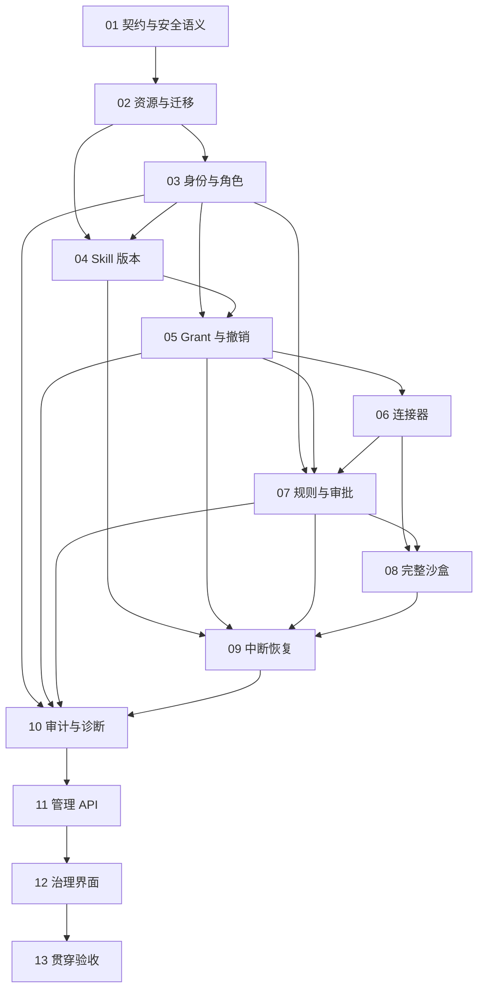

# M2 · 安全与治理实施任务卡

> 日期：2026-10-05 ｜ 状态：M2-01 至 M2-13 实施与自动验收完成，等待所有者人工核验与收口确认 ｜ 实际结果：[M2验收报告](../acceptance/M2.md)
> 设计依据：[权限治理详设](../architecture/governance.md)、[Harness 与 Session](../architecture/harness-session.md)、[M1 实施卡](./M1-cards.md)、[ADR-008](../decisions/ADR-008-tool-admission-and-sandbox.md)、[F009 数字员工与授权管理](../features/F009-employee-and-governance.md)。

## 领取与交付约定

所有者于 2026-10-03 明确授权暂缓 M1 人工验收并立即进入 M2，开工依据见 [M2 开工授权](../acceptance/M2-start-authorization.md)。M1-01 至 M1-13 实施与自动验收完成，八项贯穿验收 8/8、后端 535 项测试通过及 M0 回归通过；M1 人工验收与收口确认仍待完成。按照 M2-01 至 M2-13 顺序领取，每张卡提交真实验收记录、提交并推送后领取下一张。卡片实际状态仅按实施与验收证据更新。

每张卡交付代码、必要回归和 `docs/acceptance/M2-XX.md`；公开证据进入 `docs/acceptance/assets/M2/XX/`。真实运行数据、升级快照、凭据及中间结果存入已忽略的工作目录，不使用 `/tmp`。公开 SQL、JSON、截图和日志必须脱敏，截图发布前逐张检查。失败写明实际状态、归属卡片及返工建议。

复用 M0 的审批服务、串行写入通道、三级闸门、副作用账本、恢复流程、审计链和 Seatbelt；复用 M1 的三库、技能读取、变更账本、快照及后台作业。自有判定放入 `agentcrew_core`，文件、SQLite、API 和生命周期放入 `agentcrew_server`。新增文件在领取对应卡片时创建，迁移编号根据当时实际版本分配，不修改已发布迁移。

测试遵循 [ADR-006](../decisions/ADR-006-no-mock-testing.md)：真实 Electron、当前配置的 main/aux 模型、真实文件、真实 SQLite、真实子进程及 SIGKILL。自有规则、角色判定和状态转换可直接参数化测试。断言工具声明、请求、文件、事件和数据库状态，不断言模型必定说出某句话或再次请求某项能力。

## 参考源码与已有实现

| 范围 | 参考位置与用途 |
|---|---|
| 资源、不可变版本与授权 | [OpenWork plugin-arch.ts](../../../openwork/ee/packages/den-db/src/schema/sharables/plugin-arch.ts)：`ConfigObjectTable`、`ConfigObjectVersionTable`、`ConfigObjectAccessGrantTable`；采用资源与授权分离的模型 |
| 权限决策与规则匹配 | [ZCode service.ts](../../../ZCode/apps/zcode-cli/packages/core/src/permission/service.ts)、[rule-matching.ts](../../../ZCode/apps/zcode-cli/packages/core/src/permission/rule-matching.ts)：工具元数据、规则及决策原因 |
| 审批交互与挂起管理 | [AionUi chatLib.ts](../../../AionUi/packages/desktop/src/common/chat/chatLib.ts)、[ipcBridge.ts](../../../AionUi/packages/desktop/src/common/adapter/ipcBridge.ts)：审批对象与交互契约；AgentCrew 沿用自身四选项语义 |
| 沙盒和保护路径 | [EasyMint access-policy.ts](../../../EasyMint/app/main/services/permission/access-policy.ts)、[sandbox/manager.ts](../../../EasyMint/app/main/services/sandbox/manager.ts)：判定层与强制层、规则同源和保护路径 |
| 连接器工具治理 | [EasyMint mcp-broker.ts](../../../EasyMint/app/main/services/permission/mcp-broker.ts)、[mcp-adapter.ts](../../../EasyMint/app/main/services/permission/mcp-adapter.ts)：连接器发现、调用及权限边界 |
| 审计链与独立锚点 | [learn-workbuddy code.py](../../../learn-workbuddy/s23_audit_sandbox/code.py)：哈希链机制；AgentCrew 使用已有 SQLite 审计与库外链头 |

这些源码位于本仓库同级参考目录，提供设计参考，不作为运行依赖。当前 M0 已有真实规则与审计实现，M2 以此增加治理能力。

| 已有代码 | M2 接入点 |
|---|---|
| `backend/agentcrew_core/tools/gate.py`、`judgment.py` | 命令等值、路径规范化、域名、deny 优先及 protected/scope 判断 |
| `backend/agentcrew_server/approvals.py` | 单事务审批、规则写入、真实 actor、授权撤销复查与过期审批 |
| `backend/agentcrew_core/tools/builtin/seatbelt.py` | 现有写范围、网络禁止、受保护路径禁读写；增加普通文件读取强制范围 |
| `backend/agentcrew_server/run_manager/__init__.py`、`sessions.py` | 工作区与员工选择、任务配置快照、按授权组装工具及执行前复查 |
| `backend/agentcrew_server/recovery.py`、`api/recovery.py` | 三类副作用核验、身份检查和恢复时的当前授权 |
| `backend/agentcrew_server/db/audit.py`、`api/app.py` | 内部链、链头锚点、只读诊断及治理 API 的访问限制 |

## 卡片顺序与依赖

| 卡片 | 负责范围 | 前置卡片 | 主要负责者 | 状态 |
|---|---|---|---|---|
| M2-01 | 契约、安全语义与作用域 | 所有者 M2 开工授权 | 后端，前端共同核对 | 已完成，见 [验收](../acceptance/M2-01.md) |
| M2-02 | 资源数据、旧库迁移与种子组织 | M2-01 | 后端 | 已完成，见 [验收](../acceptance/M2-02.md) |
| M2-03 | 本地认证、演示身份与 RBAC | M2-02 | 后端 | 已完成，见 [验收](../acceptance/M2-03.md) |
| M2-04 | Skill 不可变版本与 M1 账本接入 | M2-02、M2-03 | 后端 | 已完成，见 [验收](../acceptance/M2-04.md) |
| M2-05 | Grant、能力隔离与实时撤销 | M2-03、M2-04 | 后端 | 已完成，见 [验收](../acceptance/M2-05.md) |
| M2-06 | HTTP/MCP 连接器与执行边界 | M2-05 | 后端 | 已完成 |
| M2-07 | 员工规则、审批与提权防线 | M2-03、M2-05、M2-06 | 后端 | 已完成 |
| M2-08 | 完整 Seatbelt 读取与写入限制 | M2-06、M2-07 | 后端 | 已完成 |
| M2-09 | 当前授权下的中断恢复与核验 | M2-04、M2-05、M2-07、M2-08 | 后端 | 已完成，见 [验收](../acceptance/M2-09.md) |
| M2-10 | 治理审计、锚点与只读诊断 | M2-03、M2-05、M2-07、M2-09 | 后端 | 已完成，见 [验收](../acceptance/M2-10.md) |
| M2-11 | 管理 API 与契约贯穿核对 | M2-02 至 M2-10 | 后端 | 已完成，见 [验收](../acceptance/M2-11.md) |
| M2-12 | 治理操作、授权清单与诊断界面 | M2-11 | 前端 | 已完成，见 [验收](../acceptance/M2-12.md) |
| M2-13 | 七项治理验收与安全贯穿回归 | M2-12 | 前端、后端共同验收 | 已完成，见 [验收](../acceptance/M2-13.md) |

## M2-01 · 契约、安全语义与作用域

**依赖与范围。** 所有者 M2 开工授权已经满足；M1 人工验收与收口确认仍待完成。本卡交付跨层决策和契约，由后端维护，前端核对管理状态；不提前创建空业务模块。更新 `docs/contracts/openapi.yaml`、`docs/contracts/events.md`、`docs/architecture/governance.md`、`docs/architecture/harness-session.md`，在 `docs/decisions/` 记录必要 ADR。

**实施内容。** 完整定义组织、工作区、用户、成员角色、员工、技能版本、连接器、grant 和权限规则的身份与关联。明确 owner/admin/member 操作矩阵、成员会话归属、跨工作区访问、资源禁用、并发修订及删除保留历史。补齐成员查询、当前身份、演示身份切换、治理资源 CRUD、授予撤销、规则回收、审计过滤/校验/导出、备份恢复接口，逐个指定实现卡片；每项 operation 都有真实 HTTP 验收。

权限语义使用统一规则：`bash` 按完整命令等值匹配；资源必须先满足 scope 和 protected 限制，再判断角色、grant、规则和审批。工作区外但已由用户授权加入 scope 的目录可以审批，scope 外直接拒绝。deny 不被 allow 或人工审批覆盖。M2 的 bash 网络继续全部禁止，HTTP 和 MCP 的网络调用走受控连接器。

确定会话三库冻结、任务技能版本快照、当前授权过滤三者的关系。历史配置和正文用于解释执行环境，不能授予当前已撤销的能力；每次任务组装、模型请求、工具派发、审批提交和恢复均检查当前授权。明确正在执行的调用撤销后如何取消和核验：未派发调用拒绝，已派发调用停止后续操作并按真实副作用状态处理。

**验收与失败。** 制作 API 操作矩阵和事件作用域表，覆盖 M2 七项验收、完整读取沙盒及与 M1 的接入。执行 `cd backend && uv run --with pyyaml python ../scripts/check_openapi.py`。身份来源不明确、后台作业可提权、撤销边界缺失、连接器能绕过域名或接口没有实现归属均判失败。证据进入 `docs/acceptance/M2-01.md`。

## M2-02 · 资源数据、旧库迁移与种子组织

**依赖与范围。** M2-01。新增 `backend/agentcrew_server/governance/resources.py`、`seed.py` 和 `backend/tests/test_governance_resources.py`，通过现有版本化迁移增加治理数据。外键和数据约束按实际存储模型实现。

**实施内容。** 建立组织、工作区、用户、成员、员工、技能及版本、连接器与授权数据。迁移 M0 的 `default` 工作区和员工、现有 owner 规则及 M1 文件身份，保留会话标识、材料路径、事件游标、审批、账本和审计哈希。升级前沿用 `VACUUM INTO` 产生自洽快照。未知历史身份必须显式校验和映射，不能删除记录、换成新会话或静默授予全部能力。

幂等创建演示科技有限公司、日常办公和数据分析工作区，以及 owner、王明 admin、李蕾 member、小文和小刚。小文具有指定办公技能和 HTTP 连接器，小刚具有 SQL 技能并且无 HTTP 授权。内置文件能力按本项目工具体系映射，不能把未运行的文件 MCP 标为连接成功。技能材料必须能实际读取并执行，种子不得包含凭据或直接修改审计记录。

资源删除采用保留历史的禁用或归档语义，限制有活动引用的物理删除；关联外键、当前版本和有效授权的唯一性由 SQLite 约束保证。重新运行 seeder 不覆盖用户修改、不恢复已撤销 grant、不重置角色或规则。

**验收与失败。** 执行 `cd backend && uv run pytest -q tests/test_governance_resources.py`。使用含真实 M0/M1 历史的独立库升级，两次迁移及 seeder 后核对行数、外键、文件哈希、事件游标和审计链；真实中断迁移后不能出现半套结构。证据进入 `docs/acceptance/M2-02.md`，任何历史丢失或意外新增授权均判失败。

## M2-03 · 本地认证、演示身份与 RBAC

**依赖与范围。** M2-02。新增 `backend/agentcrew_server/governance/identity.py`、`backend/tests/test_governance_identity.py`，接入 `api/auth.py`、`api/sessions.py` 和请求上下文。

**实施内容。** 保留现有随机 Bearer 作为本地调用凭证，服务端解析有效成员和角色。演示切换只能通过已认证、按契约允许的操作产生，不信任客户端任意提供的 actor/role；界面及记录明确其演示性质。每个请求固定自己的有效身份，不能使用共享可变全局身份污染其他窗口、并发请求或后台任务。

owner 管理组织、角色和审计校验；admin 管理所属工作区资源、grant 和规则；member 只能使用已授权员工及访问自己的会话与运行记录。将检查覆盖到已有会话列表、messages、材料、文件产物、SSE、排队、停止、审批、核验和恢复接口，避免只保护新管理端点。禁止移除最后一名有效 owner。

审批、任务和后台作业记录发起身份；人类操作审计记录真实本地凭证所属者及有效演示身份。角色或成员资格撤销后，新请求及执行前检查使用当前权限，长期 SSE 订阅按契约关闭或过滤，不能继续接收已无权查看的内容。

**验收与失败。** 执行 `cd backend && uv run pytest -q tests/test_governance_identity.py`。启动真实 HTTP 服务，核对无/错误凭证 401、member 管理操作 403、跨工作区和非本人会话访问拒绝、最后 owner 保护、并发身份隔离及角色撤销后 SSE 权限。证据进入 `docs/acceptance/M2-03.md`，仅隐藏导航不算 RBAC 验收通过。

## M2-04 · Skill 不可变版本与 M1 账本接入

**依赖与范围。** M2-02、M2-03。新增 `backend/agentcrew_server/governance/skills.py`、`backend/tests/test_governance_skills.py`，接入 M1 的 `memory/skills.py`、写入恢复协议和任务组装。

**实施内容。** 发布技能时新增不可变 `skill_versions`，更新当前版本引用；历史版本不允许修改或删除，以数据库约束或触发器阻止普通业务 SQL 改写。文件与 SQLite 的一致性沿用 M1 变更意图及恢复机制，同一 `change_id` 对应一次版本发布和账本记录。`skill_patch`、人工编辑和从账本恢复内容都经过同一服务；恢复旧正文也产生新版本。

任务建立时绑定技能版本及员工配置，历史任务和恢复尝试保留这些引用；后续新任务使用最新配置。会话三库冻结保持 M1 语义，技能索引和正文按任务版本及当前 grant 过滤。技能内容即使出现授权指令，也不能修改角色、连接器、grant、规则或保护目录。

**验收与失败。** 执行 `cd backend && uv run pytest -q tests/test_governance_skills.py`。真实发布两个版本、恢复旧正文并形成第三个版本，核对文件、账本、版本行和哈希；同时验证旧任务引用不变、新任务使用新版本、并发发布冲突及写入中 SIGKILL 后恰好一次。证据进入 `docs/acceptance/M2-04.md`。

## M2-05 · Grant、能力隔离与实时撤销

**依赖与范围。** M2-03、M2-04。新增 `backend/agentcrew_server/governance/grants.py`、`backend/tests/test_governance_grants.py`，接入任务组装、M1 工具、审批及事件订阅。

**实施内容。** 实现 agent 对 skill/connector 的授权、user 对 agent 的可见性授权，默认拒绝。grant 校验资源、接受者和组织/工作区关联；授予与撤销、审计及 `governance.grant_changed` 在同一写通道事务提交。撤销填写 `revoked_at`，重新授予产生可追踪新记录。

无 grant 的技能不进入有效索引，无 grant 的连接器不注册工具。执行器独立校验调用权限，阻止手工提交隐藏工具或复用历史工具调用。授权视图不能依赖模型遗忘旧技能；每次请求和派发重新核对当前 grant。授权撤销不能被 M1 快照、缓存、后台白名单、旧审批或恢复记录覆盖。

授权检查与 `dispatched` 登记使用同一串行写入顺序：撤销先提交的调用不能登记派发，已经登记派发的调用请求取消并核对副作用，不能撤销已经发生的外部效果。员工禁用、成员撤权及连接器禁用采用相同检查入口。事件与 UI 显示具体失效原因，历史任务保留原配置和结果。

**验收与失败。** 执行 `cd backend && uv run pytest -q tests/test_governance_grants.py`。用真实任务核对小刚请求的工具声明无 HTTP；在小文任务运行、等待审批和中断恢复期间分别撤销授权，核对后续派发、技能读取及下一任务索引。SQL 对比 grant、事件与审计，验证重复请求幂等和跨工作区拒绝。证据进入 `docs/acceptance/M2-05.md`。

## M2-06 · HTTP/MCP 连接器与执行边界

**依赖与范围。** M2-05。新增 `backend/agentcrew_server/governance/connectors.py`、`backend/agentcrew_server/connectors/mcp.py` 和 `backend/tests/test_governance_connectors.py`，复用现有 `http_request`、工具调度器和副作用分类。

**实施内容。** 实现 HTTP 与 MCP 配置、启停、真实连接校验和授权后的工具注册。MCP 使用成熟 SDK，按 M2-01 契约支持声明的传输方式；协议、schema、超时和关闭行为通过真实服务器验证。工具名称带稳定连接器身份，拒绝与内置工具冲突；工具风险及只读属性来自管理员批准的元数据，缺少声明时按需审批和 `outcome_unknown` 处理。

HTTP 的 `allowed_hosts` 是硬约束，人工审批和员工 allow 规则都不能放宽连接器范围；检查目标主机、端口、重定向及契约允许的本地地址。MCP 网络传输同样受连接器目标限制。凭据由服务端绑定，读取配置只返回脱敏状态，不允许模型替换认证头，不将凭据写入输入、事件或产物。stdio MCP 子进程使用受控环境、生命周期和沙盒，不能通过连接器启动命令取得平台目录或任意网络权限。

只有连接器明确声明且真实上游支持去重的端点才使用 `external_idempotency`，同次调用复用稳定幂等键；普通 HTTP/MCP 写操作默认 `outcome_unknown`。连接失败、协议错误或缺少 grant 明确报告，不以空工具列表掩盖配置错误。

**验收与失败。** 执行 `cd backend && uv run pytest -q tests/test_governance_connectors.py`。运行真实 HTTP 服务和实际 MCP SDK 服务器，验证真实发现及工具调用、跨连接器隔离、禁用/撤销、重定向、域名拒绝、凭据脱敏和退出收割。测试服务器执行实际文件或持久化请求操作，不返回编造成功结果。去重验收查服务端真实操作次数与数据库记录。证据进入 `docs/acceptance/M2-06.md`。

## M2-07 · 员工规则、审批与提权防线

**依赖与范围。** M2-03、M2-05、M2-06。新增 `backend/agentcrew_server/governance/rules.py`、`backend/tests/test_governance_rules.py`，接入现有 `approvals.py`、`tools/gate.py` 与 `test_approvals.py`。

**实施内容。** 实现员工已授权规则查询、人工创建与回收；路径规范化后按目录范围匹配，bash 完整命令等值匹配，HTTP 域名规则受连接器范围约束。deny 优先于 allow，scope、protected、角色和 grant 是不可通过审批扩大的边界。四种决定和规则写入保留现有单事务及幂等语义，记录当前有效审批身份。

审批绑定调用参数、员工、资源及当前授权条件；提交时再次检查角色、grant、资源状态与活动执行方。已中断、取消或失去执行方的未处理审批不能新增允许规则，返回明确过期错误；已有决定的相同请求保持幂等。恢复后只处理新尝试的有效审批，界面旧记录维持失效展示。

agent 与后台作业的工具面不包含角色、grant、权限规则和连接器配置写入。治理操作只能由授权人类通过 API 发起，通用文件工具与子进程仍不能直接读写治理数据库、配置、技能及记忆载体。

**验收与失败。** 执行 `cd backend && uv run pytest -q tests/test_governance_rules.py tests/test_gate.py tests/test_approvals.py`。验证 allow/reject 的本次及永久决定、deny 优先、规则回收、符号链接和追加命令；真实 SIGKILL 后提交旧卡必须拒绝，恢复新卡可批准。工作区外审批使用已加入 scope 的独立目录，真正 scope 外拒绝且文件不变。证据进入 `docs/acceptance/M2-07.md`。

## M2-08 · 完整 Seatbelt 读取与写入限制

**依赖与范围。** M2-06、M2-07。修改 `backend/agentcrew_core/tools/builtin/seatbelt.py`、`bash.py`、`judgment.py` 及连接器子进程启动，新增 `backend/tests/test_governance_sandbox.py`，复用现有 profile 生成入口。

**实施内容。** 同一份已规范化 scope/protected 数据驱动应用判定与 Seatbelt profile。scope 包含工作区、导入材料和用户授权目录；普通用户文件读取及写入均由操作系统限制。系统可执行文件、动态库和运行所需资源单独列出必要只读权限，不能把整个 home 或用户数据目录作为运行依赖放行。

保留 bash 网络全部禁止、受保护路径读写双向禁止及环境白名单。核对路径转义、符号链接、更换链接、尚未创建的保护文件、目录前缀混淆和子进程继承。规则及 grant 只控制是否允许发起调用，不能扩大强制层 scope。内部 Skill/Memory 的受控服务保持既有领域入口，通用 bash 和 MCP 子进程无权改写。

**验收与失败。** 执行 `cd backend && uv run pytest -q tests/test_governance_sandbox.py tests/test_tools_builtin.py`。真实运行 `/usr/bin/sandbox-exec`，核对 scope 内读写成功，scope 外普通文件读取和写入失败，凭据/记忆/数据库禁读写、网络请求未抵达本地监听服务、后台子进程继承限制。受保护文件只使用独立无凭据测试数据。profile 无法加载时拒绝执行，禁止脱离沙盒重试。证据进入 `docs/acceptance/M2-08.md`。

## M2-09 · 当前授权下的中断恢复与核验

**依赖与范围。** M2-04、M2-05、M2-07、M2-08。修改现有 `server/recovery.py`、`api/recovery.py`、`run_manager/__init__.py` 与 M1 检查点接入，新增 `backend/tests/test_governance_recovery.py`。

**实施内容。** 恢复保留任务标识、原技能版本、三库快照、压缩检查点和副作用账本，同时核对当前操作者、员工状态、grant、连接器和路径权限。先核验已派发调用的真实结果，再决定是否允许新的执行；授权撤销不能抹去已发生的效果，也不能触发重发。

`verifiable` 按目标内容 SHA 核验；`external_idempotency` 同次调用保留外部键并遵循真实端点承诺；`outcome_unknown` 及哈希不一致进入待核验，人工确认前没有任何后续派发。核验、继续和重新执行均需当前权限。模型恢复后提出的新调用拥有新 `call_id`，正常经过当前规则，不按参数相同自动跳过。

对于中断期间授权或版本视图改变，保存新尝试的实际有效工具声明、授权检查结果及指纹，历史尝试不改写。旧审批失效，角色与 grant 变化原因可查，取消子进程后没有孤儿进程或隐藏后台写入。

**验收与失败。** 执行 `cd backend && uv run pytest -q tests/test_governance_recovery.py tests/test_c9_recovery.py tests/test_recovery_replay.py`。真实 Electron 任务运行中 SIGKILL，重启期间撤销一项能力后点击恢复；核对已完成文件不重复写入、未派发调用拒绝、未知效果进入待核验及旧卡无法批准。HTTP 去重只用真实支持去重的服务验证。证据进入 `docs/acceptance/M2-09.md`。

## M2-10 · 治理审计、锚点与只读诊断

**依赖与范围。** M2-03、M2-05、M2-07、M2-09。新增 `backend/agentcrew_server/api/audit.py`、`backend/tests/test_governance_audit.py`，接入现有 `db/audit.py`、`api/app.py`、诊断与迁移快照。

**实施内容。** 扩展治理审计覆盖资源变更、角色、身份切换、grant、规则、审批、拒绝、重要工具执行、核验及审计验证。业务写入与对应审计和事件保持同事务，发布顺序保持提交顺序。审计查询支持 actor/action/resource、稳定分页与脱敏导出；普通成员不得查询其他成员的记录。

校验分别报告内部全量重算和 `chain-head.txt` 锚点范围，保留每 100 条及正常退出的快照纪律。既有锚点丢失、格式损坏或锚点与数据库不符必须显式报告，不能把未执行锚点验证显示为两级全绿。明确数据目录外备份锚点的使用方式及保护边界。

校验失败进入只读诊断模式，允许经认证的诊断查询、导出、验证及受控备份恢复；任务、工具、治理写入和身份提权操作禁用。链损坏时校验结果不能追加到损坏链后伪装正常审计。恢复入口仅接受服务管理的已验证快照，说明数据库恢复与整目录恢复的影响；保留当前损坏材料供核验，恢复结束经重启和完整校验才能恢复业务。

**验收与失败。** 执行 `cd backend && uv run pytest -q tests/test_governance_audit.py tests/test_audit.py`。用独立真实库验证中间记录篡改、删行、数据库截断、锚点丢失及格式损坏；重启后诊断可用、业务禁用，断点、过滤及导出可查。使用已验证备份恢复并再次重启，通过两级校验及一项真实任务。证据进入 `docs/acceptance/M2-10.md`。

## M2-11 · 管理 API 与契约贯穿核对

**依赖与范围。** M2-02 至 M2-10。新增 `backend/agentcrew_server/api/governance.py`、`backend/tests/test_governance_api.py`，统一接入前述领域服务；审计路由继续维护于 `api/audit.py`。

**实施内容。** 完成工作区、员工、技能/版本、连接器、grant、规则、成员角色、有效身份与演示切换的实际 HTTP 接口；复核审计与诊断接口。创建或编辑员工验证岗位、模型槽、技能和连接器引用，服务端保存可追踪修订；会话选用真实工作区和员工。历史会话保留配置快照，当前授权独立执行。

每项操作遵守角色、资源归属、预期修订、请求幂等、分页及标准错误信封。治理事件定义明确资源与可见范围；没有会话关联的组织操作保留专属审计标识，不伪造前台 task_run_id 或 seq。持久化授权和角色是业务状态，不从执行事件反向重建。

**验收与失败。** 执行 `cd backend && uv run pytest -q tests/test_governance_api.py` 和 `uv run --with pyyaml python ../scripts/check_openapi.py`。按 M2-01 操作矩阵逐项请求真实服务，保存成功及拒绝结果并核对 schema；覆盖错误身份、跨范围、陈旧修订、重复撤销和分页。再次核对既有 messages、SSE、材料和恢复的访问控制。端点未实现、响应与契约不符或只靠前端限制均判失败。证据进入 `docs/acceptance/M2-11.md`。

## M2-12 · 治理操作、授权清单与诊断界面

**依赖与范围。** M2-11。前端新增 `desktop/src/renderer/src/Governance.tsx`，接入 `App.tsx`、`session.ts`、`Conversation.tsx` 和 M1 管理组件；新增 `desktop/tests/m2-governance.mjs`，更新 `docs/tasks/frontend-cards.md`。

**实施内容。** 提供 M2 验收所需的工作区与员工选择、有效演示身份、角色管理、资源与 grant 管理、员工授权规则回收、审计查询和两级校验。界面只能操作真实接口，展示来源、范围、修订、禁用和撤销状态，明确本次审批与永久规则的影响。技能版本与 M1 账本关联，历史版本可查，恢复正文产生新版本。

无权操作、空状态、加载、失败、并发冲突和撤销期间的有效性变化都要可见；编辑失败保留草稿，身份切换后重新查询并清除无权缓存，不在订阅或浏览器存储中遗留其他身份的内容。后台审批沿用 M1 作业身份，历史卡保持失效。诊断界面提供断点、脱敏导出和受控恢复，业务操作持续禁用直到后端校验通过。

本卡对应 FE12 的治理接入与 FE13 的授权、角色及诊断操作；沿用产品 UI 规格和设计系统。M3 的完整 Agent Studio、Admin Center 页面整合、运行中心和自动化按其独立实施卡推进，本卡提供实际可验收的全部 M2 管理操作。

**验收与失败。** 执行 `cd desktop && npm run typecheck && npm run build && node tests/m2-governance.mjs`。真实 Electron 切换成员、授予及撤销能力、回收规则、显示有效新审批、查询并验证审计；篡改独立验收库后重启，界面进入诊断并完成受控恢复。刷新后身份、授权状态与查询结果一致，键盘和焦点可操作。截图与脱敏 JSON 进入 `docs/acceptance/assets/M2/12/`，记录进入 `docs/acceptance/M2-12.md`。

## M2-13 · 七项治理验收与安全贯穿回归

**依赖与范围。** M2-12。新增 `scripts/seed/m2_governance_data.py`，使用治理 seeder 和 API 创建可重置的真实材料；扩展 `desktop/tests/m2-governance.mjs`，交付 `docs/acceptance/M2.md`。

**实施内容。** 真实运行小文、小刚和三种角色的工作流。报告逐项给出实际结果、模型、任务/尝试标识、SQL 查询、审计序号、事件及工具声明、文件 SHA/mtime 和截图路径。模型没有某种预期表达时，按工具声明与调用拒绝核对能力边界；需要新审批时使用实际合法写入任务驱动，不硬凑模型动作。

| 治理详设验收项 | 负责卡片 | 必须保存的真实证据 |
|---|---|---|
| 1. 工作区规则与外部目录审批 | M2-07、M2-08、M2-12 | 真实写入审批、总是允许规则、同目录后续写入、已授权外部目录仍审批、scope 外拒绝及文件对照 |
| 2. deny 规则直接拒绝 | M2-07、M2-10 | 无新审批事件、拒绝原因、审计和目标文件未修改 |
| 3. 小刚无 HTTP 能力 | M2-05、M2-06、M2-08 | 实际工具声明无 HTTP、直接调用拒绝、bash/MCP 不能绕过，记录模型真实回答 |
| 4. member 管理操作拒绝 | M2-03、M2-11、M2-12 | 真实 403、界面状态、会话及 SSE 隔离，actor 与有效演示身份 |
| 5. Grant 撤销即时生效 | M2-04、M2-05、M2-09 | 新任务索引变化、等待审批后撤销、恢复后执行前复查及历史快照保留 |
| 6. 篡改后的只读诊断与恢复 | M2-09、M2-10、M2-12 | 独立库篡改、重启断点、业务拒绝、导出与受控恢复、恢复后的真实任务 |
| 7. 审计查询与两级验证 | M2-10、M2-11、M2-12 | actor/action/resource 查询、内部全量重算、锚点 seq/hash、界面真实结果 |

此外必须通过完整沙盒、安全连接器和副作用恢复验收：系统强制阻止 scope 外普通读取/写入及 bash 网络；真实 HTTP/MCP 遵守 grant 和连接器范围；技能历史版本不可修改；SIGKILL 后内容核验、外部幂等及待核验停机规则正确。构造边界材料只用于自有判定和实际进程验证，不替代真实上游。

回归 M1 八项能力，重点检查冻结快照与当前权限、技能发布与账本一致性、后台取消和禁止提权；重跑 M0 的材料、审批、队列、刷新与恢复，核对前台终态、投影、历史审批和文件副作用。任何失败按归属卡片返工，不扩大允许范围以通过测试。

**最终检查。** 在 `backend/` 执行 `uv sync`、`uv run pytest -q` 和 `uv run --with pyyaml python ../scripts/check_openapi.py`；在 `desktop/` 执行 `npm run typecheck`、`npm run build` 和真实贯穿脚本。报告七项分别计分，附额外安全检查结果及实际缺口；代码、测试和脱敏证据提交推送后停止，等待所有者最终人工核验与 M2 收口确认。
