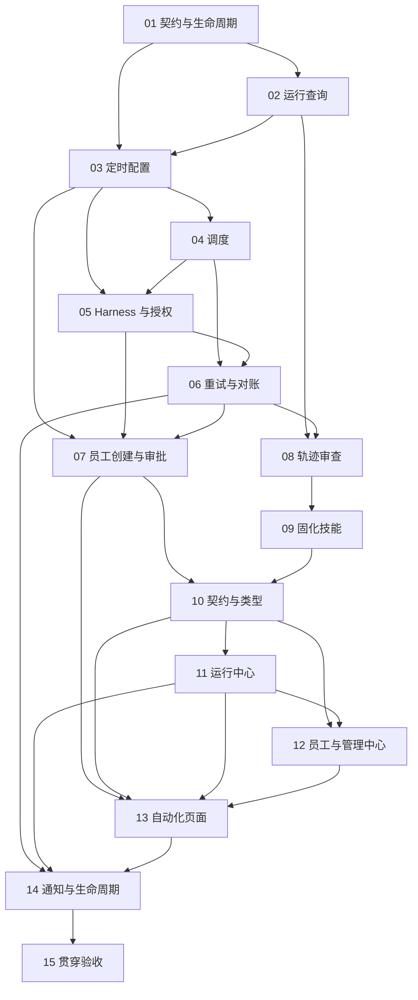

# M3 · 监控回放与自动化实施任务卡

> 日期：2026-10-09 ｜ 状态：M3-01 至 M3-12 已通过；M3-13 实施完成，后端真实回归待复验；M3-14、M3-15 未开始 ｜ 实施起点：desktop-shell `dc29b7854f1d8977ac51ab3da23022c57a4e9f28`
> 设计依据：[定时任务与轨迹审计详设](../architecture/cron-and-audit.md)、[Harness 与 Session](../architecture/harness-session.md)、[M1 实施卡](./M1-cards.md)、[M2 实施卡](./M2-cards.md)、[桌面前端计划](../plans/2026-09-29-desktop-frontend.md)。

## 领取与交付约定

M3 功能实施依据[所有者开工授权](../acceptance/M3-start-authorization.md)开始：M2 实施与自动验收完成，所有者授权暂缓 M2 人工验收并立即进入 M3。M1/M2 人工核验与收口确认继续待完成，暂缓不构成人工验收通过。按 M3-01 至 M3-15 顺序领取，每张卡完成实现、回归、真实验收、提交和推送后领取下一张；M1/M2 依赖以实际代码和验收证据重新核查。

每张卡交付 `docs/acceptance/M3-XX.md`，公开证据进入 `docs/acceptance/assets/M3/XX/`。真实数据库、运行材料、凭据和中间结果使用已忽略的工作目录，不使用 `/tmp`。截图、SQL、JSON 和日志公开前检查敏感信息；失败记录实际状态、归属卡片和返工建议。

复用既有 TaskRun、事件/投影、串行写通道、恢复、审批、审计链、Electron sidecar、通知与会话订阅。M1 提供辅助模型作业、结构化压缩、记忆与技能账本；M2 提供身份、grant、不可变技能版本、连接器与完整沙盒。运行回放只读取历史；自动化执行仍由正常 Harness 完成。

测试遵循 [ADR-006](../decisions/ADR-006-no-mock-testing.md)：真实 Electron、当前配置的 main/aux 模型、真实文件、SQLite、网络服务和进程。调度计算可以向自有纯函数传入时刻参数，集成验收使用真实当前时间、秒级计划、SIGSTOP/SIGCONT 或 SIGKILL，不伪造全局时钟和外部响应。模型未生成报告或技能建议时记录实际判断，不断言它必定提出某种建议。

## 参考源码与产品范围

| 内容 | 参考位置与用途 |
|---|---|
| 计划、状态及调度 | [AionCore types.rs](../../../AionCore/crates/aionui-cron/src/types.rs)、[scheduler.rs](../../../AionCore/crates/aionui-cron/src/scheduler.rs)、[executor.rs](../../../AionCore/crates/aionui-cron/src/executor.rs)：四段式配置、时区、到期与运行冲突 |
| 定时接口与界面 | [AionUi ipcBridge.ts](../../../AionUi/packages/desktop/src/common/adapter/ipcBridge.ts)、[CreateTaskDialog.tsx](../../../AionUi/packages/desktop/src/renderer/pages/cron/ScheduledTasksPage/CreateTaskDialog.tsx)、[TaskDetailPage.tsx](../../../AionUi/packages/desktop/src/renderer/pages/cron/ScheduledTasksPage/TaskDetailPage.tsx)：真实计划、运行历史与创建来源 |
| 后台审查与取消 | [Hermes background_review.py](../../../hermes-agent/agent/background_review.py)、[review_engine.py](../../../hermes-agent/agent/review_engine.py)、[review_idle_queue.py](../../../hermes-agent/agent/review_idle_queue.py)：白名单、前台优先及作业结束握手 |
| 事件与历史投影 | [Eigent models.py](../../../eigent/backend/app/run_journal/models.py)、[context_projection.py](../../../eigent/backend/app/run_journal/context_projection.py)：持久化事实、调用与结果关联；AgentCrew 使用自身事件格式 |
| 会话及尝试关联 | [AionCore reducer.rs](../../../AionCore/crates/aionui-session/src/reducer.rs)、[state.rs](../../../AionCore/crates/aionui-session/src/state.rs)：状态与恢复尝试的表示 |
| 产品与页面职责 | [F007 自动化](../features/F007-automation.md)、[F008 运行中心](../features/F008-run-center.md)、[F009 员工与治理](../features/F009-employee-and-governance.md)、[UI 规格](../design/ui-spec.md)、[设计系统](../design/design-system.md) |

参考源码位于本仓库同级目录，不作为运行依赖。AgentCrew 的 cron 采用单机单进程调度，不引入多实例租约。页面行为与视觉沿用本项目产品和设计规格。

## 卡片顺序与依赖

| 卡片 | 负责范围 | 前置卡片 | 主要负责者 | 状态 |
|---|---|---|---|---|
| M3-01 | 契约、调度与审查生命周期 | M2 自动验收完成及所有者开工授权 | 后端，前端共同核对 | [已通过](../acceptance/M3-01.md) |
| M3-02 | 运行查询、分页轨迹与指标 | M3-01 | 后端 | [已通过](../acceptance/M3-02.md) |
| M3-03 | 定时配置、发生记录与管理 API | M3-01、M3-02 | 后端 | [已通过](../acceptance/M3-03.md) |
| M3-04 | 调度、时区、错过与冲突 | M3-03 | 后端 | [已通过](../acceptance/M3-04.md) |
| M3-05 | Harness 接入与无人值守授权 | M3-03、M3-04 | 后端 | [已通过](../acceptance/M3-05.md) |
| M3-06 | 重试、重启对账与副作用核验 | M3-04、M3-05 | 后端 | [已通过](../acceptance/M3-06.md) |
| M3-07 | 员工自建定时任务与强制审批 | M3-03、M3-05、M3-06 | 后端 | [已通过](../acceptance/M3-07.md) |
| M3-08 | 轨迹读取与后台审计 Agent | M3-02、M3-06 | 后端 | 已通过 |
| M3-09 | 审计建议固化为技能 | M3-08 | 后端 | 已通过 |
| M3-10 | 接口贯穿核对与前端类型生成 | M3-02 至 M3-09 | 后端、前端 | 已通过 |
| M3-11 | Run Center 时间线与回放 | M3-10 | 前端 | 已完成，真实验收通过 |
| M3-12 | Agent Studio 与 Admin Center | M3-10、M3-11 | 前端 | [已通过](../acceptance/M3-12.md) |
| M3-13 | 自动化页面与创建审批 | M3-07、M3-10、M3-11、M3-12 | 前端 | 实施与桌面真实流程已完成；后端真实回归待复验（[当前记录](../acceptance/M3-13.md)） |
| M3-14 | 通知、休眠、托盘与退出影响 | M3-06、M3-11、M3-13 | 前端、后端 | 未开始 |
| M3-15 | 自动化与四屏贯穿验收 | M3-14 | 前端、后端共同验收 | 未开始 |

## M3-01 · 契约、调度与审查生命周期

**依赖与范围。** M2 自动验收完成及所有者开工授权。更新 `docs/contracts/openapi.yaml`、`docs/contracts/events.md`、`docs/architecture/cron-and-audit.md` 和必要跨层 ADR，核对 F007/F008/F009 及 FE11–FE14；本卡交付契约与实施约束。

**实施内容。** 定义运行列表、尝试、分页事件、调用明细、指标、审计报告、计划 CRUD、run-now、运行历史、技能固化和退出影响接口。明确排序、游标、快照水位、作用域、成功/错误信封及异步 202。区分模型审查报告与 M2 安全审计链，报告保存所引用的 task_run_id、attempt_no、seq 和事件水位。

确定 `at/every/cron` 的表达式支持范围、时区、最小间隔、夏令时、过期 at、正常定时延迟与错过窗口、冲突、停用及手动运行语义。持久化一次计划发生记录和各次重试关联，明确最多三次重试是初始执行后的额外次数。已有会话的 queue_paused、等待用户、待核验及其他运行中的任务都不能被定时执行绕过。

确定权限交集：当前角色/grant、scope/protected、连接器约束和 deny 是硬边界；需审批调用同时满足员工 allow 与计划预授权才能执行，范围外拒绝并通知，不能等待人类。`schedule_task` 的创建批准具有不可免除的人工确认语义，审批参数、所选授权范围和最终计划绑定。计划范围选择器只能缩小当前允许的候选范围。

定义 `cron.job_fired/missed/skipped/failed`、审查作业状态和 `audit.reported`。尚未产生会话或 TaskRun 的 missed/skipped 使用作业域持久事件与独立游标，不伪造会话或任务；已关联任务的事件保留对应标识。定义通知唯一标识、重放与已读语义，以及中断重启后的待核验状态。

**验收与失败。** 按接口逐项指定实施卡片，核对自动化七项验收与四屏产品范围，执行 `cd backend && uv run --with pyyaml python ../scripts/check_openapi.py`。调度重试与 TaskRun 身份混淆、审批可绕过、事件无归属、缺少页面操作接口均判失败。证据进入 `docs/acceptance/M3-01.md`。

## M3-02 · 运行查询、分页轨迹与指标

**依赖与范围。** M3-01。新增 `backend/agentcrew_server/runs.py`、`backend/tests/test_run_center_api.py`，扩展 `api/runs.py`、`api/sse.py` 及现有查询，复用事件与投影。

**实施内容。** 实现按工作区、员工、会话、状态、时间及来源查询 TaskRun，展示 initial/resume 等尝试、步骤、模型调用、工具调用、审批、产物和错误。分页采用稳定排序与排他游标；一个读取快照内取得记录和事件水位，持续追加时不遗漏、不重复。按 task_run_id/attempt_no/seq 精确定位事件，跨任务 global_seq 的自然间隔不能误报为本任务事件丢失。

指标从 SQL 投影计算并与事件核对，分别展示任务状态、模型 token/延迟、步骤和工具结果。汇总前分别聚合各表，避免一对多关联重复累计 usage。任务完成率明确分母；模型 usage 缺失标为未知或不完整，不冒充零消耗。文件内容正确性单独由实际产物核验，不能用 completed 状态证明结果质量。

读取遵守 M2 身份与会话可见性，保留 M1 压缩前原始事实和工件来源；模型请求只返回允许展示的摘要及实际工具声明，凭据和隐藏推理不进入界面或导出。事件、产物或投影缺失分别报告实际状态。

**验收与失败。** 执行 `cd backend && uv run pytest -q tests/test_run_center_api.py`。真实任务包含审批、工具失败和中断恢复，保存列表、分页与定位结果，SQL 对比 llm_calls/tool_calls 计数及 usage；持续写入期间遍历分页，验证水位、游标和跨身份拒绝。证据进入 `docs/acceptance/M3-02.md`。

## M3-03 · 定时配置、发生记录与管理 API

**依赖与范围。** M3-01、M3-02。新增 `backend/agentcrew_server/cron/store.py`、`api/cron.py` 和 `backend/tests/test_cron_store.py`，沿用版本化迁移及串行写通道。

**实施内容。** 保存 schedule、target、metadata、state 四段式配置，包含创建来源、有效创建身份、员工/技能版本快照、会话模式和批准范围。建立 `cron_jobs`、`cron_job_runs`，以 `(job_id, scheduled_at)` 唯一约束定时发生；手动 run-now 由 client_request_id 绑定独立触发身份，实际触发时间另存，不占定时唯一键。重试与实际 TaskRun 建立独立关联，保留每次失败和来源，不以多条 fired 记录重复计次。

实现真实计划 CRUD、启停、run-now 与分页运行历史。每次变更校验角色、资源引用、工作区、预期修订及参数，持久化审计。绑定 M1 的真实技能引用，启用计划引用的技能获得遗忘豁免，停用或删除后释放对应引用；技能引用与 grant 独立管理。删除保留已发生记录及任务历史。

调度 revision 防止旧定时器执行已修改/停用计划；重启能从数据库恢复每项 next_run_at 和重试状态。作业域事件持久化并支持按权限补读；不能只发内存通知而丢失未打开页面期间的状态。

**验收与失败。** 执行 `cd backend && uv run pytest -q tests/test_cron_store.py`。真实 HTTP 创建并编辑三种计划，核对并发修订、重复提交、启停、历史和迁移；SIGKILL 后配置及发生记录保持一致。真实运行 M1 curator，验证被启用计划引用的技能免归档、解除引用后规则恢复。证据进入 `docs/acceptance/M3-03.md`。

## M3-04 · 调度、时区、错过与冲突

**依赖与范围。** M3-03。新增 `backend/agentcrew_core/cron/schedule.py`、`backend/agentcrew_server/cron/scheduler.py` 和 `backend/tests/test_cron_scheduler.py`，接入后端生命周期。

**实施内容。** 使用成熟 cron 库与标准时区能力解析计划，不编写表达式 parser。调度计算为接受时刻参数的自有函数；运行时使用真实时钟并在唤醒后重新检查已持久化的到期时间。每项计划由既有事件循环管理定时等待，启动恢复、到期和手动触发通过同一串行登记入口。

到期先核对计划状态、revision 和上次运行。应用停止、休眠或事件循环停止跨过的时间点记录 missed，不补跑；下一次 every 按既定节奏计算，不能靠每次完成时间不断推迟。大量连续错过的处理须保留可查的覆盖时间与次数，不能展开成执行任务。DST 重复与不存在时刻按 M3-01 契约处理，时间倒退不能重复已经登记的 occurrence。

上一轮仍在运行、等待用户或待核验时记录 skipped，不堆积任务；手动 run-now 使用独立发生身份并经过同样冲突检查。过期 at 记为 missed 并结束该一次性计划。停用及修改完成后旧定时器不得再次触发。

**验收与失败。** 执行 `cd backend && uv run pytest -q tests/test_cron_scheduler.py`。纯函数核对 UTC、时区和 DST；真实秒级 every、临近 at 和合法 cron 到期执行，SIGSTOP/SIGCONT 及 SIGKILL 跨过到期窗口，SQL 核对 missed、skipped、下一次时间和 occurrence 唯一性。空表达式、非法时区或间隔在创建时明确拒绝。证据进入 `docs/acceptance/M3-04.md`。

## M3-05 · Harness 接入与无人值守授权

**依赖与范围。** M3-03、M3-04。新增 `backend/agentcrew_server/cron/executor.py`、`backend/tests/test_cron_execution.py`，接入既有 `sessions.py`、`run_manager/__init__.py`、审批与授权检查。

**实施内容。** 到期以事务登记 occurrence、关联 TaskRun 和执行来源，提交后才派发；实际执行使用正常 Harness、M1 上下文及 M2 沙盒。existing 模式校验同一工作区与员工的有效会话，保持上下文和队列暂停语义；new_conversation 按计划快照建立新会话。新任务使用计划绑定的员工/技能内容，但当前 grant、角色、员工启用及连接器状态仍须复查。

需审批调用必须同时命中员工 allow 和计划预授权；任何 deny、scope/protected 或连接器范围拒绝均停止该调用并记录原因。只读调用也必须满足当前资源范围和能力授权。无人值守不得发出等待人类的审批或提问；`ask_user` 等交互工具按契约拒绝并明确反馈，不形成永久 waiting_user。手动 run-now 保持相同无人值守闸门。

既有会话忙碌、队列已暂停或存在待核验时，登记 skipped 并保留原因；不能替用户继续队列、取消前台任务或偷偷改为新会话。终态同步更新发生记录、job.state 和通知，事件与投影同事务且只发布一次。

**验收与失败。** 执行 `cd backend && uv run pytest -q tests/test_cron_execution.py`。真实模型完成 existing/new 两种模式的文件任务；验证两层允许、任一缺失、deny、跨范围、撤销 grant、员工禁用和 ask_user 拒绝。核对 TaskRun 回链、文件、审计、事件及无人值守无挂起审批；暂停队列保持暂停。证据进入 `docs/acceptance/M3-05.md`。

## M3-06 · 重试、重启对账与副作用核验

**依赖与范围。** M3-04、M3-05。新增 `backend/agentcrew_server/cron/recovery.py`、`backend/tests/test_cron_recovery.py`，复用现有副作用核验与 M1 检查点。

**实施内容。** 可重试失败在失败后 30 秒重试，最多额外三次；重试归属原 occurrence，记录次数、实际 TaskRun 和原事件关联，不能伪装成新的计划到期。执行前再次检查 enabled、revision、grant、deny 和运行冲突。停用、权限拒绝、待核验或未知副作用禁止自动重试。

初始失败存在已完成副作用时，不能从头重新执行整条指令；依据原事件、内容校验和调用账本判断能否安全接续，无法证明时停止自动重试并显示人工处理状态。核验幂等端点仍遵守 M2 真实承诺，同一逻辑调用使用原外部键；模型新调用保持新身份及正常权限判断。

重启先完成 TaskRun 中断与副作用对账，再恢复定时器。已经登记 fired 但尚未派发、执行已完成但发生记录未收敛等窗口都必须有明确处理，不因缺少终态再次执行。interrupted/待核验 occurrence 占用该计划的未完成状态，后续到期 skipped；经授权的人类从正常恢复入口处理后再解除。

**验收与失败。** 执行 `cd backend && uv run pytest -q tests/test_cron_recovery.py`。通过实际错误上游地址或真实子进程错误制造失败，核对 30 秒、三次上限和重启后的次数；在登记/派发/写入完成窗口真实 SIGKILL，核对唯一 occurrence、文件 SHA/mtime、待核验与后续 skipped。验证已产生副作用不会被从头重试。证据进入 `docs/acceptance/M3-06.md`。

## M3-07 · 员工自建定时任务与强制审批

**依赖与范围。** M3-03、M3-05、M3-06。新增 `backend/agentcrew_core/tools/builtin/schedule_task.py`、`backend/tests/test_schedule_task_approval.py`，接入现有工具 metadata、调度器和审批服务。

**实施内容。** 员工提出计划时提交不可变提案，包含名称、时刻/时区、指令、员工、会话模式和建议预授权。创建前必须经授权人类明确批准，不能被 `allow_always`、只读声明或后台白名单免除。审批展示可选范围，用户只能从当前合法候选中缩小范围；重新核对权限并将最终选择与提案 input_hash、批准身份和 revision 一起持久化。

批准与计划创建、审计和发生来源关联具有幂等语义。拒绝、取消、参数变化、执行方失效或中断后的旧提案不能创建计划；重放已批准决定不产生第二项计划。`created_by=agent` 和 `created_via_task_run_id` 保留，人类通过 API 直接创建则记录实际人类身份。

**验收与失败。** 执行 `cd backend && uv run pytest -q tests/test_schedule_task_approval.py`。真实会话指示员工建立秒级计划，核对批准前数据库无新 job，批准后只创建一次；验证拒绝、重复提交、always 规则无法免除、范围缩小、越权选择和 SIGKILL 后旧审批失效。随后真实触发并产生文件，证明创建结果实际可运行。证据进入 `docs/acceptance/M3-07.md`。

## M3-08 · 轨迹读取与后台审计 Agent

**依赖与范围。** M3-02、M3-06。新增 `backend/agentcrew_core/tools/builtin/trace_read.py`、`backend/agentcrew_server/reviews/trace_audit.py`、`backend/tests/test_trace_audit.py`，复用 M1 作业管理和 aux 槽。

**实施内容。** `trace_read` 按权限读取指令、步骤、模型 usage/延迟、工具与结果、审批、错误及重试，结果带来源事件标识和水位。仅提供脱敏内容与可检索工件；不读取治理凭据，也不把另一成员的任务带入检索。

失败任务立即登记高优先级审查，每五个完成任务登记批量审查；计数和触发水位持久化、幂等。复用 M1 前台两秒取消及成本预算，白名单只有 `trace_read`、`session_search`。审查作业独立于前台 TaskRun 终态，不因报告生成失败改变原任务状态。重启后中断作业明确标记，不无限重复触发同一失败任务。

报告包含 summary、verdict、root_cause、原始事件定位、建议、异常及可选 skill_proposal，保留模型、生成时间和输入水位。验证 schema、事件存在并属于相应任务；缺少依据时允许 cause 为空，不制造定位。允许 Nothing to report，并保存 skipped 及原因；有报告才发 `audit.reported`。报告期间目标恢复或水位变化时标明适用尝试，禁止把旧报告覆盖为当前结论。

**验收与失败。** 执行 `cd backend && uv run pytest -q tests/test_trace_audit.py`。真实完成五个任务并运行一项真实失败任务，核对触发、优先级、取消期限、作业状态和 aux usage。核对报告事件引用及跨身份拒绝；模型无报告时保存实际判断，再用实际存在的失败证据明确请求分析，不断言模型一定生成建议。证据进入 `docs/acceptance/M3-08.md`。

## M3-09 · 审计建议固化为技能

**依赖与范围。** M3-08。新增 `backend/agentcrew_server/reviews/promote_skill.py`、`backend/tests/test_audit_promote_skill.py`，接入 M1 Skill 分支与 M2 版本服务。

**实施内容。** 报告存在可用 skill_proposal 时，授权人类确认后启动固化作业，来源绑定报告、原始任务及事件水位。调用既有 read-before-write、配额、修订冲突和账本机制，发布 `source=agent` 的不可变新技能版本。已有技能优先按建议更新；内容和机制说明仍由真实模型产出，不能用测试文本代替实际提炼。

固化操作只发布技能，不自动创建 grant 或修改员工权限。完成后展示当前是否已授权；管理员通过 M2 管理操作授权后，下一任务有效索引才包含该技能。重复确认、作业取消、无建议或发布失败分别返回实际状态，不宣称已可复用。

**验收与失败。** 执行 `cd backend && uv run pytest -q tests/test_audit_promote_skill.py`。从真实分析报告发起确认，核对版本、正文、账本和事件；授权后真实任务读取并使用该技能。若模型未提出建议，记录该状态并针对已分析的实际流程请求建议，仍需实际有效提案才能验收固化链。证据进入 `docs/acceptance/M3-09.md`。

## M3-10 · 接口贯穿核对与前端类型生成

**依赖与范围。** M3-02 至 M3-09。新增 `backend/agentcrew_server/api/reviews.py`、`backend/tests/test_m3_contracts.py`，完善前述运行和自动化 API；前端维护 `desktop/src/renderer/src/api/generated/` 与 `desktop/package.json`。

**实施内容。** 对 M3-01 操作矩阵逐项实现真实接口，覆盖报告查询/固化、作业状态、计划及运行历史、运行查询、指标、精确定位和退出影响。核对 CRUD、异步 202、幂等、分页、角色和跨范围拒绝；没有报告、未生成会话、计划已停用和待核验各有明确状态。

使用成熟 OpenAPI 生成器产生 TypeScript 类型，提供 `npm run gen:api` 与 `npm run check:api`，逐步接替已有集中 DTO，并覆盖所有本次使用接口。HTTP 类型来自 OpenAPI，事件联合类型由正式事件 JSON schema 生成或校验，不能让未知事件变成伪造类型。差异检查不得修改生成文件后直接宣称通过。

**验收与失败。** 执行 `cd backend && uv run pytest -q tests/test_m3_contracts.py` 及 `uv run --with pyyaml python ../scripts/check_openapi.py`；在 `desktop/` 执行 `npm run gen:api`、`npm run check:api` 和 `npm run typecheck`。保存所有真实 HTTP 的状态与脱敏响应，核对实际运行事件；接口缺失、类型陈旧或访问控制遗漏均判失败。证据进入 `docs/acceptance/M3-10.md`。

## M3-11 · Run Center 时间线与回放

**依赖与范围。** M3-10。前端新增 `desktop/src/renderer/src/run-center/RunCenter.tsx`、`Replay.tsx` 和 `desktop/tests/m3-run-center.mjs`，对应 FE11/F008，接入现有导航及会话事件。

**实施内容。** 展示真实运行列表、过滤、指标、尝试、步骤、模型/工具明细、审批和产物来源。任务页、自动化记录和通知能够进入同一 TaskRun；失败报告可按任务和事件 seq 跳转，目标不在当前页时真实加载定位范围。报告明显标为模型分析，原始事件保持独立可查。

回放按持久事件顺序播放、暂停和单步，选择范围与当前游标可在刷新后恢复。历史回放不调用模型、执行工具、提交审批或修改任务状态；现有审批卡用于历史展示时操作按钮禁用。运行中的实时尾部与用户选择的回放位置分别处理，后续事件追加不能自动覆盖用户正在查看的历史。

缺少原事件、工件、报告或投影时展示对应实际错误；权限撤销后立即停止无权读取和显示。按现有设计处理长工具输出、折叠、窄窗口、键盘和焦点，避免全部历史一次加载造成不可用。

**验收与失败。** 执行 `cd desktop && npm run check:api && npm run typecheck && npm run build && node tests/m3-run-center.mjs`。真实任务完成、失败和 SIGKILL 恢复后核对时间线、尝试切换、报告跳转、分页、刷新及播放控制。回放期间核对 llm_calls/tool_calls、文件 SHA/mtime 和写 API 请求均不增加。证据进入 `docs/acceptance/M3-11.md`。

## M3-12 · Agent Studio 与 Admin Center

**依赖与范围。** M3-10、M3-11。前端新增 `desktop/src/renderer/src/agents/AgentStudio.tsx`、`admin/AdminCenter.tsx` 和 `desktop/tests/m3-management.mjs`，对应 FE12/FE13/F009。

**实施内容。** 完整组织员工列表、创建/编辑、岗位、状态、模型槽、技能版本、连接器、soul/三库、授权清单和所属定时任务。管理中心整合成员角色、演示身份、grant、规则回收、连接器配置和真实校验、审计过滤、两级验证、导出及只读诊断恢复。复用 M1 的 Memory 与 M2 Governance 服务和组件，保持同一状态来源。

新任务使用已保存配置，历史任务展示当时快照；授权撤销和资源禁用仍即时影响当前权限。固化技能展示提案来源、版本和授权状态，不能把发布当成自动授予能力。编辑有并发冲突时保留草稿并显示修订，敏感配置只展示脱敏状态。

身份切换、角色撤销及诊断模式下，导航、缓存、订阅和可执行操作同步更新。管理页操作可返回相应任务、报告和事件，员工档案里的定时任务链接指向真实记录。

**验收与失败。** 执行 `cd desktop && npm run check:api && npm run typecheck && npm run build && node tests/m3-management.mjs`。真实创建员工、修改岗位及技能、编辑记忆、撤销 grant/规则、切换 member 并验证真实 403；核对旧任务快照和新任务配置。独立库篡改后验证诊断、导出和受控恢复流程，刷新状态一致。证据进入 `docs/acceptance/M3-12.md`。

## M3-13 · 自动化页面与创建审批

**依赖与范围。** M3-07、M3-10、M3-11、M3-12。前端新增 `desktop/src/renderer/src/automation/Automation.tsx` 和 `desktop/tests/m3-automation.mjs`，接入既有审批卡，对应 FE14/F007。

**实施内容。** 提供 at/every/cron、时区、员工、指令、existing/new_conversation、预授权范围的真实创建与编辑。显示启停、next_run_at、创建身份、最近状态、发生记录及重试；手动运行仍展示其无人值守权限。查看每次执行可进入对应 TaskRun、报告和 Run Center。

员工 `schedule_task` 审批卡展示原始提案与合法范围选择器，仅提供契约允许的人工决定；改变选择不改写模型提案，不将永久允许规则当作创建批准。拒绝、取消或旧卡失效时没有假成功状态。范围、配置或角色失效时保持草稿并展示实际服务端错误。

分别展示 missed、skipped、failed、interrupted、待核验和已完成，等待人工处理时提供已有安全入口；不能从自动化页面绕过核验或替用户继续暂停队列。任务禁用、删除及编辑对正在执行和未来执行的影响明确可见，页面刷新及订阅重连恢复历史。

**验收与失败。** 执行 `cd desktop && npm run check:api && npm run typecheck && npm run build && node tests/m3-automation.mjs`。真实创建三种计划，界面批准员工提案、触发、停用、编辑并查找产物；制造 missed/skipped、预授权拒绝和待核验，核对页内状态与 SQL。证据进入 `docs/acceptance/M3-13.md`。

## M3-14 · 通知、休眠、托盘与退出影响

**依赖与范围。** M3-06、M3-11、M3-13。修改 `desktop/src/main/index.ts`、`preload/index.ts`、`desktop-api.d.ts` 及设置界面，新增 `desktop/tests/m3-lifecycle.mjs`；后端接入 `runtime.py` 与退出影响接口。

**实施内容。** 使用持久通知身份和权限范围消费真实 cron/审查事件。成功用徽标，失败、被拒和错过使用桌面通知；通知点击可重新显示窗口并导航真实 job/TaskRun。重放不重复弹通知，窗口隐藏期间仍可接收已授权通知，重启后未读状态可查询。系统通知权限不足时如实显示应用内状态，不能宣称系统提醒已经送达。

退出影响来自真实后端查询，列出活跃任务、待核验和未来 24 小时计划；确认后按现有清理预算停止定时器、辅助作业、模型流和子进程，再写链头并退出。实现设置中的关窗即退出和阻止休眠，托盘关窗保持调度；设置从受控接口及限定 preload 调用读取写入，不暴露任意进程或文件能力。

监听真实休眠/唤醒状态，唤醒让后端重新计算 missed 和后续时间。电脑关机或应用真正退出期间不能执行，不把防休眠设置描述成关闭后的执行保证。退出取消、sidecar 重启和通知导航之间不得触发重复调度。

**验收与失败。** 执行 `cd desktop && npm run typecheck && npm run build && node tests/m3-lifecycle.mjs`。真实关闭窗口后任务触发、托盘重新打开、通知导航、刷新不重复弹出、退出影响核对及真正退出后无残留进程；重新启动核对 missed。使用真实 SIGSTOP/SIGCONT 验证暂停后的对账，实际 macOS 休眠/唤醒另留真实电源事件证据，未发生就记录未验收。证据进入 `docs/acceptance/M3-14.md`。

## M3-15 · 自动化与四屏贯穿验收

**依赖与范围。** M3-14。新增 `scripts/seed/m3_automation_data.py` 生成可重置的真实材料，新增 `desktop/tests/m3-acceptance.mjs`，交付 `docs/acceptance/M3.md`。

**实施内容。** 从 Cowork 交代真实任务，批准员工创建定时计划，到实际触发和失败分析，在 Run Center 定位事件、确认技能提案，再从 Agent Studio 发布与授权并执行后续任务；Admin Center 核对角色、权限、审计及诊断。使用独立数据目录与当前配置的真实模型，保存 TaskRun、尝试、occurrence、作业及事件水位，SQL 和产物校验均附完整查询与脱敏结果。

| 定时与轨迹详设验收项 | 负责卡片 | 必须保存的真实证据 |
|---|---|---|
| 1. at/every/cron 真实触发 | M3-03、M3-04、M3-05、M3-13 | 创建参数、时区、scheduled_at、实际启动、文件与唯一发生记录 |
| 2. 错过不补跑与冲突不积压 | M3-04、M3-06、M3-14 | SIGSTOP/SIGCONT、SIGKILL 和真实唤醒记录、missed/skipped SQL、后续时间和无重复副作用 |
| 3. 既有会话与新建会话 | M3-05、M3-13 | 实际会话/任务关联、上下文与快照、暂停队列及待核验保持原状态 |
| 4. 无人值守预授权边界 | M3-05、M3-06、M3-13 | 两层允许、任一缺失/deny/撤销的拒绝事件、文件未修改、审计及通知 |
| 5. 失败审查与原事件定位 | M3-02、M3-08、M3-11 | 真实失败、作业状态、实际报告或跳过理由、有效事件引用与页面跳转 |
| 6. 报告固化为技能并复用 | M3-09、M3-12 | 实际提案、真人确认、技能版本/账本、独立 grant、下一任务有效索引与读取 |
| 7. 员工创建必经真人批准 | M3-07、M3-13 | 审批卡与范围选择、批准前无 job、批准后唯一 job、拒绝及旧卡不能创建 |

七项之外，四屏产品和安全回归必须通过：Run Center 播放/暂停/单步及刷新不增加执行；Agent Studio/Admin Center 完整管理、历史快照和真实权限；通知、托盘、退出影响与电源状态真实有效；所有操作有实际接口和事件来源。模型没有报告或提案时记录状态，使用实际证据驱动到可验收终态；没有成功提案和版本就不能把技能固化项判为通过。

重跑 M0 材料、审批、队列、刷新和中断恢复，M1 八项记忆与压缩能力，M2 七项治理及完整沙盒/连接器边界；SQL 核对事件与投影、occurrence/retry 数量、通知标识和审计两级校验。重点验证未完成副作用阻止自动重试、旧审批失效、后台两秒取消和技能定时引用豁免。

**最终检查。** 在 `backend/` 执行 `uv sync`、`uv run pytest -q` 和 `uv run --with pyyaml python ../scripts/check_openapi.py`；在 `desktop/` 执行 `npm run check:api`、`npm run typecheck`、`npm run build` 和真实贯穿脚本。报告分别给出七项计分、四屏与生命周期检查、实际缺口及证据，全部提交推送后停止，等待所有者最终人工核验与 M3 收口确认。
